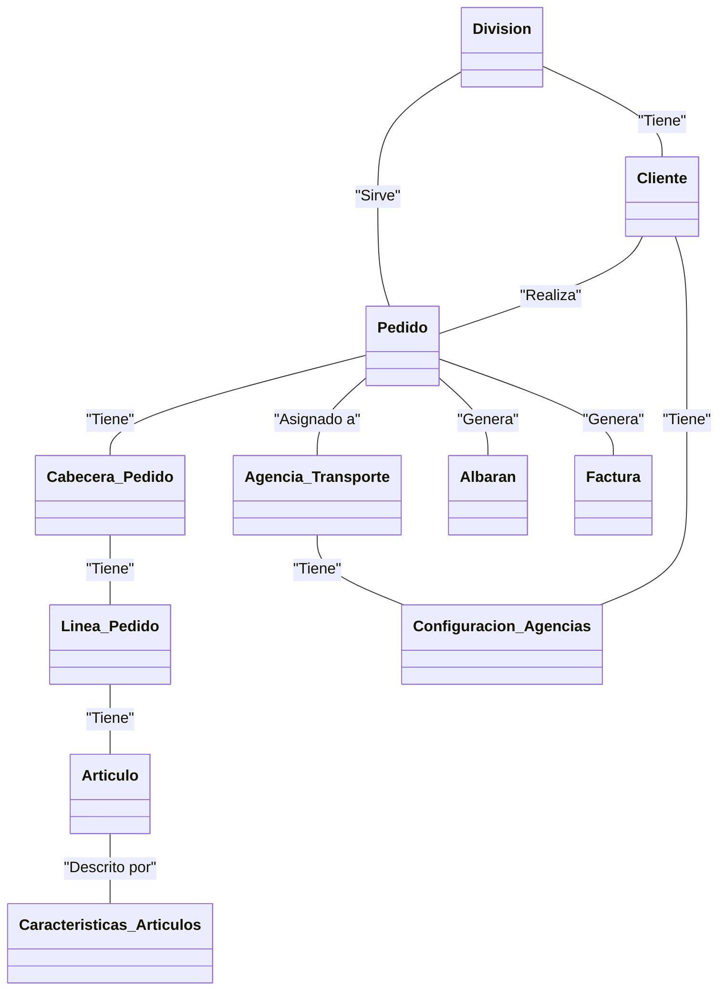

# DOCUMENTACIÓN

## Índice

- [Estructura BBDD](#id_estructura)
	- [Diagrama general](#id_diagrama_general) 	
	- [División](#id_division) 
	- [Pedidos](#id_pedidos)
		- [Pedido Origen](#id_pedido_origen)
		- [Pedido Final](#id_pedido_final)
		- [Cabecera de pedido](#id_cabecera_pedido)
	- [Status](#id_status)

- [Incidencias](#id_incidencias)
	- [Error: No consiguen facturar (INCYTE)](#id_incidencia_no_facturar)
	- [Contadores de facturación para facturas, abonos y rectificativas (BIOCON)](#id_incidencia_contador_facturacion)
	- [Generación de carpetas](#id_incidencia_generacion_carpeta)
	- [Proceso de envió de Facturas diarias .ZIP](#id_facturas_diarias_ZIP)
	- [Integración GATEWAY](#id_integracion_gateway)
		- [ProductXR](#id_productxr)
		- [CustomerXR](#id_customerxr)
		- [PO & ASN Confirmation](#id_po_asn_confirmation)
		- [Ship Confirmation](#id_ship_confirmation)
		- [Proof Of Delivery (POD)](#id_pod)
		- [Stock Transactions](#id_stock_transaction)
		- [Stock Reconciliation](#id_stock_reconciliation)
		- [Invoices](#id_invoices)
		- [Payments (cash receipt)](#id_payments)
		- [OpenInvoices (aged balance)](#id_openinvoices)
		- [WIP (Work In Progreess)](#id_wip)

- [Subidas a producción](#id_subir_a_produccion)
	- [Subir Visual Basic a producción](#id_subir_visual_a_produccion)
	- [Subir PL/SQL a producción](#id_subir_plsql_a_produccion)

- [Rutas de utilidad](#id_rutas)

 
<div id='id_estructura' />

## Estructura BBDD

<div id='id_diagrama_general' />

### Diagrama General



La BBDD representa diversas **Divisiones** que operan como empresas proveedoras. Estas, gestionan sus propios **Clientes**, a quienes deben suministrar los **Artículos** solicitados a través de **Pedidos**.

Los Pedidos se componen de una **Cabecera** y **Líneas** de pedido. Para cada cabecera, existen una o varias líneas.

A los pedidos se le asigna una **Agencia de Transporte**, que tiene una **Configuración** específica por Cliente.

Las líneas de pedido contienen los artículos que se servirán a los clientes. Además se pueden consultar las **Características** detalladas de cada artículo (peso, longitud...).

Después de realizar la entrega del pedido al cliente, se emite un **Albarán** que recopila los datos del pedido, así como los detalles de los paquetes y artículos suministrados.

Algunos clientes tienen un servicio de facturación. Este proceso resulta en una **Factura** que contiene datos del pedido (cálculos, precio, impuestos, forma de pago...).

Cada una de estas entidades, se describen con más detalle en la sección correspondiente.

- [División](#id_division)
- Cliente
- [Pedido](#id_pedidos)
	- Cabecera
	- Línea
- Artículo
	- Características detalladas
- Agencia de Transporte
	- Configuración de agencia
- Albarán
- Factura

<div id='id_division' />
 
### División
Para consultar la **división** de la empresa o cliente en cuestión se consulta la tabla **ipdivis**. 

```sql
select * from ipdivis;
```
Un ejemplo de los datos que nos vamos a encontrar en esta tabla:

  
| campo1 | campo2 | campo3 | campo4 | campo5 | 
|-----------|-----------|-----------|-----------|-----------|
| contenido | contenido | contenido | contenido | contenido | 
| contenido | contenido | contenido | contenido | contenido |
| contenido | contenido | contenido | contenido | contenido |
 
<div id='id_pedidos' />
 
### Pedidos
 
Los **pedidos** están formados por una cabecera y una o múltiples líneas. Esta información, que desglosaremos y detallaremos en secciones posteriores, se almacena en la BBDD en las siguientes tablas:
 
```sql
select * from ipcabpeorig; -- Cabecera de pedido origen
select * from iplinpeorig; -- Líneas de pedido origen

select * from ipcabpe; -- Cabecera de pedido
select * from iplinpe; -- Líneas de pedido
```
<div id='id_pedido_origen' />

#### Pedido Origen
El pedido origen es el resultado de la carga de datos inicial de un determinado pedido facilitado por la empresa. 

Este pedido puede facilitarse en distintos formatos (**txt**, **xlsx**, **csv**...) y ha de ser registrado en la BBDD. En este momento no se cuenta con todos los datos necesarios para conformar el pedido, pues muchos de ellos son **calculados** y será necesario ejecutar determinados procesos en la BBDD para crear el pedido final.

```sql
select * from ipcabpeorig; -- Cabecera de pedido origen
select * from iplinpeorig; -- Líneas de pedido origen
```

#### Pedido Final
Una vez cargado el [pedido origen](#id_pedido_origen) se harán los procedimientos almacenados y serán calculados todos los campos necesarios para conformar el pedido. 

```sql
select * from ipcabpe; -- Cabecera de pedido
select * from iplinpe; -- Líneas de pedido
```
#### Cabecera de pedido
A continuación se muestran los campos que forman la **clave primaria** de la cabecera del pedido.
<table>
<tr>
        <th>Campo BBDD</th>
        <th>Descripción</th>
    </tr>
    <tr>
        <td>codped</td>
        <td>Código del pedido</td>
    </tr>
    <tr>
        <td>coddiv</td>
        <td>División o compañía del pedido</td>
    </tr>
    <tr>
        <td>seqped</td>
        <td>Versión del pedido</td>
    </tr>
    <tr>
        <td>anoped</td>
        <td>Año del pedido</td>
    </tr>  
</table>

<div id='id_status' />

### Status

En esta tabla podemos ver la relación entre cada status y su descripción.

Ejemplo:

Al consultar una línea de pedido, podemos ver su status en el campo **status**. 

Para conocer la descripción de este estado debemos consultar la tabla **ipstatus**. 

```sql
SELECT tipostatus, status, desstatus
  FROM ipstatus
 WHERE tipostatus = 'LP' -- Línea de Pedido
   AND status = '500'; -- Status
```

Un ejemplo con el contenido de la tabla podría ser el siguiente:

| tipostatus | status | desstatus |
|-----------|-----------|-----------|
| LP | 5000 | LINEA DE ACONDICIONAMIENTO | 
| CP | -6950 | ERROR GENERANDO DEM. DE ACONDI | 

A continuación se muestran algunos de los tipos más utilizados:
<table>
	<tr>
        <th>Tipo Status</th>
        <th>Descripción</th>
    </tr>
	<tr>
        <td>LP</td>
        <td>Línea de Pedido</td>
    </tr>
	<tr>
        <td>CP</td>
        <td>Cabecera de Pedido</td>
    </tr>
	<tr>
        <td>IRS</td>
        <td>Impresiones (Facturas)</td>
    </tr>
</table>


<div id='id_incidencias' />

## Incidencias


<div id='id_incidencia_no_facturar' />

### Error: No consiguen facturar (INCYTE)

Para verificar que efectivamente, la factura que indican no ha sido facturada, debemos consultar el campo **contfac** en la tabla **ipcabpe**. Si este campo tiene un valor distinto de 0, se ha podido facturar.

```sql
SELECT contfac
  FROM ipcabpe
 WHERE coddiv = ''
   AND codped = '';
```

En caso de que el campo **contfac** tenga el valor 0, debemos comprobar el estado de las líneas de pedido. En caso de que una (o más) líneas tengan **status** igual a 100, el pedido no facturará.

```sql
SELECT contfac
  FROM iplinpe
 WHERE coddiv = ''
   AND codped = ''
   AND status = 100;
```

Con esta última consulta SQL podremos ver qué lineas están haciendo que no se pueda facturar el pedido.

Generalmente los clientes utilizan el traductor **frmMain.frm** para facturar los pedidos, aquí podemos ver qué comprobaciones están haciendo sobre las líneas, que pueden hacer que finalicen con error.

```sql
DECLARE
	v_coddiv	ipcabpe.coddiv%TYPE;
	v_codped	ipcabpe.codped%TYPE;

	v_contfac	ipcabpe.contfac%TYPE;
	v_count		NUMBER;
BEGIN

	------------------------------------
	--        DATOS INCIDENCIA        --
	------------------------------------

	v_coddiv := ''; -- División
	v_codped := ''; -- Código de pedido
	
	------------------------------------

	BEGIN
		SELECT contfac
		INTO v_contfac
		FROM ipcabpe
		WHERE coddiv = v_coddiv
		AND codped = v_codped;
	EXCEPTION
		WHEN NO_DATA_FOUND THEN
			dbms_output.put_line('No se ha encontrado el pedido indicado.');
			RETURN;
		WHEN TOO_MANY_ROWS THEN
			dbms_output.put_line('Varios pedidos encontrados.');
			RETURN;
	END;

	IF v_contfac != 0 THEN
		dbms_output.put_line('El pedido ya se ha podido facturar.');
		RETURN;
	END IF;

	SELECT COUNT(1)
	  INTO v_count
	  FROM iplinpe
	 WHERE coddiv = v_coddiv
	   AND codped = v_codped
	   AND status = 100;
	
	dbms_output.put_line('Se han encontrado ' || v_count || ' linea/s con status 100.');
	dbms_output.put_line('');
	dbms_output.put_line('SELECT *');
	dbms_output.put_line('FROM iplinpe');
	dbms_output.put_line('WHERE coddiv = ''' || v_coddiv || '''');
	dbms_output.put_line('AND codped = ''' || v_codped || '''');
	dbms_output.put_line('AND status = 100;');
END;
```

Una vez que se han identificado las líneas con error, deberíamos recurrir al informador e indicarle lo que sucede para cada artículo (para cada una de las líneas con status 100).

Errores frecuentes:
- "Este artículo no ha sido reportado"
- "Las cantidades reales y reportadas no coinciden"
	- Campos: En la línea de pedido **cantaservir** y **cantservida** deben tener el mismo valor.

Ruta de interés - Documentos Reportados
```
I:\FICHEROSIP6\CLIENTES\INCYTE\ENTRADA\BAK
```

La consulta que hace el traductor para ver los pedidos a facturar es la siguiente:

```sql
SELECT * 
  FROM ipcabpe CP 
 WHERE CODDIV='138' 
   AND STATUS=18999 
   AND NOT EXISTS (SELECT 1 
   					 FROM IPLINPE LP 
					WHERE LP.CODPED=CP.CODPED 
					  AND LP.CODDIV=CP.CODDIV 
					  AND LP.ANOPED=CP.ANOPED 
					  AND LP.SEQPED=CP.SEQPED 
					  AND LP.STATUS=100);
```

<div id='id_incidencia_contador_facturacion' />


### Contadores de facturación para facturas, abonos y rectificativas (BIOCON)

El objetivo de esta incidencia es configurar los contadores cuando hay un nuevo laboratorio o un nuevo cliente. Son genéricos, lo único que cambia será la división en función del cliente al que haya que configurarle los contadores. En los **INSERT** que se muestran a continuación, utilizamos la división **604**, de **BIOCON**.

```sql
Insert into T2P.XIPCONTFAC (DIVISION,NUMINI,PERIODO,SERIE,NUMACTUAL,TIPO,ABIERTO,TIPOPEDIDO,MASCARA) values ('604','1','2023','PP','2300001','F','S',null,null);
Insert into T2P.XIPCONTFAC (DIVISION,NUMINI,PERIODO,SERIE,NUMACTUAL,TIPO,ABIERTO,TIPOPEDIDO,MASCARA) values ('604','1','2023','PA','2390001','A','S',null,null);
Insert into T2P.XIPCONTFAC (DIVISION,NUMINI,PERIODO,SERIE,NUMACTUAL,TIPO,ABIERTO,TIPOPEDIDO,MASCARA) values ('604','1','2023','FI','2380001','R','S',null,null);
```

<div id='id_incidencia_generacion_carpeta' />

### Generación de carpetas

El objetivo de esta incidencia es generar las carpetas cuando hay un nuevo laboratorio o un nuevo cliente. Son genéricas, lo único que cambia será la división en función del cliente al que haya que generarle las carpetas.

Carpeta en la que se generan los pdfs para el proceso diario de envío de ZIP.
```
J:\wwwroot\xls\604\FACTURAS\OUT
```

Para el envío y la recepción de archivos (Integración con el nuevo cliente).
```
I:\IP6DATOS\INTERFASES\BIOCON
I:\IP6DATOS\INTERFASES\BIOCON\bajar
I:\IP6DATOS\INTERFASES\BIOCON\subir
I:\IP6DATOS\INTERFASES\BIOCON\errores
```

<div id='id_estructura_nombre_rpt' />


### Estructura del nombre de los reportes

El nombre de los reportes debe seguir la siguiente estructura:

"IPALBARAN" + TIPO + CODIGO DIVISION

Un ejemplo de nombre de reporte podría ser: **IPALBARANV160.rpt**

<table>
	<tr>
        <th>Tipo</th>
        <th>Descripción</th>
    </tr>
	<tr>
        <td>V</td>
        <td>ALBARAN</td>
    </tr>
	<tr>
        <td>F</td>
        <td>FACTURA</td>
    </tr>
	<tr>
        <td>P</td>
        <td>PROFORMA</td>
    </tr>
</table>

<div id='id_facturas_diarias_ZIP' />


### Proceso de envío de Facturas diarias .ZIP

El proceso de generación de facturas se ha migrado a APEX. 
Para incluír un nuevo proceso de creación de facturas **.pdf** se debe hacer en la base datos de APEX-INT en el esquema:
```
APPS - Package APPS_REPORTING_PKG - PROCEDURE launch_facturacion_alloga
```

En nuestro caso el archivo origal era este:

```sql
PROCEDURE launch_facturacion_alloga(p_job_id IN NUMBER,p_date IN DATE DEFAULT sysdate) IS
    l_start_date     VARCHAR2(30) := to_char(SYSDATE, 'dd/mm/yyyy hh24:mi:ss');
    l_retcode        NUMBER;
    l_errbuf         VARCHAR2(32676);
    l_step           VARCHAR2(255);
    l_error          VARCHAR2(32676);
    l_coddiv        VARCHAR2(12);
    l_date          DATE;
BEGIN
 
	dbms_output.put_line('l_date: ' || p_date);
	l_date := nvl(p_date,sysdate);
	dbms_output.put_line('l_date: ' || l_date);
	launch_factura_division(p_job_id => p_job_id,p_coddiv => '122',p_date => l_date,p_prefix => 'BLF-INVOICE');
	launch_factura_division(p_job_id => p_job_id,p_coddiv => '193',p_date => l_date,p_prefix => 'OUT\INVOICE');
	launch_factura_division(p_job_id => p_job_id,p_coddiv => '471',p_date => l_date,p_prefix => 'OUT\INVOICE');
	launch_factura_division(p_job_id => p_job_id,p_coddiv => '473',p_date => l_date,p_prefix => 'OUT\INVOICE');
	launch_factura_division(p_job_id => p_job_id,p_coddiv => '474',p_date => l_date,p_prefix => 'OUT\INVOICE');
	launch_factura_division(p_job_id => p_job_id,p_coddiv => '476',p_date => l_date,p_prefix => 'OUT\INVOICE');

EXCEPTION
    WHEN OTHERS THEN
        IF p_job_id <> -99 THEN
            apexc_scheduler.set_job_error_message(p_job_id => p_job_id,  p_message => 'An unexpected error ocurred for launch_facturacion_alloga ' || to_char(SYSDATE, 'dd/mm/yyyy hh24:mi:ss') || ' - ' || SQLCODE || ': ' || SQLERRM);
        ELSE
            RAISE;
        END IF;
END launch_facturacion_alloga;
```
Agregamos una línea para cada nueva división, en nuestro caso las divisiones **602** y **604**.
```sql
launch_factura_division(p_job_id => p_job_id,p_coddiv => '602',p_date => l_date,p_prefix => 'OUT\INVOICE');
launch_factura_division(p_job_id => p_job_id,p_coddiv => '604',p_date => l_date,p_prefix => 'OUT\INVOICE');
```

El archivo final quedaría como se muestra a continuación:

```sql
PROCEDURE launch_facturacion_alloga(p_job_id IN NUMBER,p_date IN DATE DEFAULT sysdate) IS
    l_start_date     VARCHAR2(30) := to_char(SYSDATE, 'dd/mm/yyyy hh24:mi:ss');
    l_retcode        NUMBER;
    l_errbuf         VARCHAR2(32676);
    l_step           VARCHAR2(255);
    l_error          VARCHAR2(32676);
    l_coddiv        VARCHAR2(12);
    l_date          DATE;
BEGIN
 
	dbms_output.put_line('l_date: ' || p_date);
	l_date := nvl(p_date,sysdate);
	dbms_output.put_line('l_date: ' || l_date);
	launch_factura_division(p_job_id => p_job_id,p_coddiv => '122',p_date => l_date,p_prefix => 'BLF-INVOICE');
	launch_factura_division(p_job_id => p_job_id,p_coddiv => '193',p_date => l_date,p_prefix => 'OUT\INVOICE');
	launch_factura_division(p_job_id => p_job_id,p_coddiv => '471',p_date => l_date,p_prefix => 'OUT\INVOICE');
	launch_factura_division(p_job_id => p_job_id,p_coddiv => '473',p_date => l_date,p_prefix => 'OUT\INVOICE');
	launch_factura_division(p_job_id => p_job_id,p_coddiv => '474',p_date => l_date,p_prefix => 'OUT\INVOICE');
	launch_factura_division(p_job_id => p_job_id,p_coddiv => '476',p_date => l_date,p_prefix => 'OUT\INVOICE');

	----------------------------------------------------------------------------------------------------------
	--                                           NUEVAS LÍNEAS                                              --
	----------------------------------------------------------------------------------------------------------
	
	launch_factura_division(p_job_id => p_job_id,p_coddiv => '602',p_date => l_date,p_prefix => 'OUT\INVOICE');
	launch_factura_division(p_job_id => p_job_id,p_coddiv => '604',p_date => l_date,p_prefix => 'OUT\INVOICE');

	----------------------------------------------------------------------------------------------------------
 
EXCEPTION
    WHEN OTHERS THEN
        IF p_job_id <> -99 THEN
            apexc_scheduler.set_job_error_message(p_job_id => p_job_id,  p_message => 'An unexpected error ocurred for launch_facturacion_alloga ' || to_char(SYSDATE, 'dd/mm/yyyy hh24:mi:ss') || ' - ' || SQLCODE || ': ' || SQLERRM);
        ELSE
            RAISE;
        END IF;
END launch_facturacion_alloga;
```

<div id='id_integracion_gateway' />

### Integración Gateway (KARO)

El cliente solicita obtener información a través de Gateway. 

Grupos de información requeridos:  
- [ProductXR](#id_productxr)
- [CustomerXR](#id_customerxr)
- [PO & ASN Confirmation](#id_po_asn_confirmation)
- [Ship Confirmation](#id_ship_confirmation)
- [Proof Of Delivery (POD)](#id_pod)
- [Stock Transactions](#id_stock_transaction)
- [Stock Reconciliation](#id_stock_reconciliation)
- [Invoices](#id_invoices)
- [Payments (cash receipt)](#id_payments)
- [OpenInvoices (aged balance)](#id_openinvoices)
- [WIP (Work In Progreess)](#id_wip)

<div id='id_productxr' />

#### ProductXR

Se debe configurar el IFL I2H.INBPRODUCTXRxxx (siendo xxx la división correspondiente). Los archivos ya existen, se deben modificar para la división requerida.

Para KARO tomamos el IFL de la división 113 como base **I2H.INBPRODUCTXR113.IFL**

```sql
# Interfase: I2H.EXPEDSTD.ifl
# Función  : interfase de exportación de expediciones (VERSIÓN PARA LA DIVISION 080.)
#
# Creación :  30-06-2005
# Autor    :RIK 
###########################################
# Histórico de cambios:
# (1) 
#
 
BEGINBLOQUE=TODASDIV
    QUERY=SELECT 1 FROM DUAL;
    BPOSTHIJOS=          
           SELECT * FROM  IPSERIEEXP 
           WHERE CODSERIEEXP IN (
           			SELECT SEX.CODSERIEEXP FROM IPCABPE CP, IPSERIEEXP SEX
				WHERE CP.CODSERIEEXP = SEX.CODSERIEEXP AND SEX.STATUS=15000 AND CP.CODDIV IN ('001')
                                      				GROUP BY SEX.CODSERIEEXP);
 
           COMMIT;
    EPOSTHIJOS
ENDBLOQUE
 
BEGINBLOQUE=DIVISION
PADRE=TODASDIV
    QUERY=SELECT 'INBProductXR'||TO_CHAR(SYSDATE,'YYMMDDHH24MISS')||'.tmp' FICCEXP,
                 DIV.CODDIV, 'I:\ip6datos\interfases\GW\subir' BUZON, 'I:\ip6datos\interfases\GW\subir' ||'\BAK' BUZONBAK,
                 PIECEHASTA(BUZONOUT,'\',NUMPIECES(BUZONOUT,'\')-1) || '\ERRORES' || '\CEXPERR'||TO_CHAR(SYSDATE,'YYMMDDHH24MISS')||'.ERR' BUZONCERR,
                 PIECEHASTA(BUZONOUT,'\',NUMPIECES(BUZONOUT,'\')-1) || '\ERRORES' || '\LEXPERR'||TO_CHAR(SYSDATE,'YYMMDDHH24MISS')||'.ERR' BUZONLERR,
            USERGW 
            FROM IPDIVIS DIV  WHERE DIV.CODDIV='113';
#(1)                       
ENDBLOQUE
 
 
BEGINBLOQUE=CEXP
    ERRORES=:BUZONCERR
    PADRE=DIVISION
    BONERROR=
     	ROLLBACK;
        EXIT;
    EONERROR
 
    QUERY=  SELECT :USERGW A1, 'ATNES' A2, 'ES' A3,  NVL(ITEMNAME,CODARTDIV) A4,  NVL(ITEMNAME,CODARTDIV) A5, ART.DESART A6, 
			DECODE(CLA.CODCLASE,'FRIO','Refrigerated','PSICOTROPO','CD','Ambient') A7,
			 DECODE(CLA2.CODCLASE,'CUARENTENA','QCHold','Released') A8,
			  DECODE(CLA3.CODCLASE,NULL,'N','Y') A9,
			   (DECODE(CLA3.CODCLASE,NULL,0,CLA3.CODCLASE)*30) A10,'N' A11,'N' A12,'N' A13, 
			TRIM(TO_CHAR(APR.PESOUNI,'00000000.0000'))  A14, 
			TRIM(TO_CHAR(APR.LARGOUNI*APR.ANCHOUNI*APR.ALTOUNI/1000000 ,'00000000.0000'))  A15, 
			TRIM(TO_CHAR(UNIPAQ,'00000000.0000')) A16,'EACH' A17,'' A18, SUBSTR(ART.CODEAN,2,999) A19,  SUBSTR(ART.CODEAN,2,999) A20
			 FROM IPARTIC ART,  IPDIVIS DIV,
			  (SELECT CODART, CODCLASIF, CODCLASE FROM IPCLASEARTIC  WHERE CODCLASIF='ALMACEN') CLA,
			  (SELECT CODART, CODCLASIF, CODCLASE FROM IPCLASEARTIC  WHERE CODCLASIF='CALIDAD') CLA2,
			  (SELECT CODART, CODCLASIF, CODCLASE FROM IPCLASEARTIC  WHERE CODCLASIF='RETEST') CLA3,
			  IPARTPROPLOG APR
			 WHERE ART.CODDIV=DIV.CODDIV AND ART.CODART=CLA.CODART(+) AND ART.CODART=CLA2.CODART(+) 
			 AND ART.CODART=CLA3.CODART(+) AND ART.CODART=APR.CODART(+) AND ART.CODDIV=:CODDIV ;
 
    BPOSTQUERY= 

 
           ESCRIBEFICHERO(:BUZON,:FICCEXP, GWMATERIAL,GWMATERIAL);
           ESCRIBEFICHERO(:BUZONBAK,:FICCEXP, GWMATERIAL,GWMATERIAL);                                               
    EPOSTQUERY 
    BPOSTHIJOS=
#UPDATE XIPCABPE SET COMPICKPACK='S',CODOPEMODIF='PICKPACKSANOFI',HORAMODIF=HORASYS, FECMODIF=FECHASYS
#WHERE CODDIV=:CODDIV AND ANOPED=:ANOPED AND CODPED=:CODPED AND SEQPED=:SEQPED;
           COMMIT;
    EPOSTHIJOS
ENDBLOQUE
```

En primer lugar, modificamos CODDIV (471 para KARO) 

```sql
BEGINBLOQUE=DIVISION
PADRE=TODASDIV
    QUERY=SELECT 'INBProductXR'||TO_CHAR(SYSDATE,'YYMMDDHH24MISS')||'.tmp' FICCEXP,
                 DIV.CODDIV, 'I:\ip6datos\interfases\GW\subir' BUZON, 'I:\ip6datos\interfases\GW\subir' ||'\BAK' BUZONBAK,
                 PIECEHASTA(BUZONOUT,'\',NUMPIECES(BUZONOUT,'\')-1) || '\ERRORES' || '\CEXPERR'||TO_CHAR(SYSDATE,'YYMMDDHH24MISS')||'.ERR' BUZONCERR,
                 PIECEHASTA(BUZONOUT,'\',NUMPIECES(BUZONOUT,'\')-1) || '\ERRORES' || '\LEXPERR'||TO_CHAR(SYSDATE,'YYMMDDHH24MISS')||'.ERR' BUZONLERR,
            USERGW 
            FROM IPDIVIS DIV  WHERE DIV.CODDIV='471';
#(1)                       
ENDBLOQUE
```

A continuación modificamos el campo A2 que corresponde al VENDOR_ID. En nuestro caso es ‘KARES’ Para KARO.

```sql
BEGINBLOQUE=CEXP
    ERRORES=:BUZONCERR
    PADRE=DIVISION
    BONERROR=
     	ROLLBACK;
        EXIT;
    EONERROR
 
    QUERY=  SELECT :USERGW A1, 'KARES' A2, ...
```

Se debe garantizar que el Client_ID de los patrones de codificación del GATEWAY se encuentre configurado en el maestro de divisiones de IP6: **IPDIVIS.USERGW**

El archivo final sería **I2H.INBPRODUCTXR471.IFL** y queda como se muestra a continuación:

```sql
# Interfase: I2H.EXPEDSTD.ifl
# Función  : interfase de exportación de expediciones (VERSIÓN PARA LA DIVISION 080.)
#
# Creación :  30-06-2005
# Autor    :RIK 
###########################################
# Histórico de cambios:
# (1) 
#
 
BEGINBLOQUE=TODASDIV
    QUERY=SELECT 1 FROM DUAL;
    BPOSTHIJOS=          
           SELECT * FROM  IPSERIEEXP 
           WHERE CODSERIEEXP IN (
           			SELECT SEX.CODSERIEEXP FROM IPCABPE CP, IPSERIEEXP SEX
				WHERE CP.CODSERIEEXP = SEX.CODSERIEEXP AND SEX.STATUS=15000 AND CP.CODDIV IN ('001')
                                      				GROUP BY SEX.CODSERIEEXP);
 
           COMMIT;
    EPOSTHIJOS
ENDBLOQUE
 
BEGINBLOQUE=DIVISION
PADRE=TODASDIV
    QUERY=SELECT 'UAT_INB_ES_ProductXR'||TO_CHAR(SYSDATE,'YYMMDDHH24MISS')||'.tmp' FICCEXP,
                 DIV.CODDIV, 'I:\ip6datos\interfases\GW\subir' BUZON, 'I:\ip6datos\interfases\GW\subir' ||'\BAK' BUZONBAK,
                 PIECEHASTA(BUZONOUT,'\',NUMPIECES(BUZONOUT,'\')-1) || '\ERRORES' || '\CEXPERR'||TO_CHAR(SYSDATE,'YYMMDDHH24MISS')||'.ERR' BUZONCERR,
                 PIECEHASTA(BUZONOUT,'\',NUMPIECES(BUZONOUT,'\')-1) || '\ERRORES' || '\LEXPERR'||TO_CHAR(SYSDATE,'YYMMDDHH24MISS')||'.ERR' BUZONLERR,
            USERGW 
            FROM IPDIVIS DIV  WHERE DIV.CODDIV='471';
#(1)                       
ENDBLOQUE
 
 
BEGINBLOQUE=CEXP
    ERRORES=:BUZONCERR
    PADRE=DIVISION
    BONERROR=
     	ROLLBACK;
        EXIT;
    EONERROR
 
    QUERY=  SELECT :USERGW A1, 'KARES' A2, 'ES' A3,  NVL(ART.CODART,ITEMNAME) A4,  NVL(ART.CODARTDIV,ITEMNAME) A5, ART.DESART A6, 
			DECODE(CLA.CODCLASE,'FRIO','Refrigerated','PSICOTROPO','CD','Ambient') A7,
			 DECODE(CLA2.CODCLASE,'CUARENTENA','QCHold','Released') A8,
			  DECODE(CLA3.CODCLASE,NULL,'N','Y') A9,
			   (DECODE(CLA3.CODCLASE,NULL,0,CLA3.CODCLASE)*30) A10,'N' A11,'N' A12,'N' A13, 
			TRIM(TO_CHAR(APR.PESOUNI,'00000000.0000'))  A14, 
			TRIM(TO_CHAR(APR.LARGOUNI*APR.ANCHOUNI*APR.ALTOUNI/1000000 ,'00000000.0000'))  A15, 
			TRIM(TO_CHAR(UNIPAQ,'00000000.0000')) A16,'EACH' A17,'' A18, SUBSTR(ART.CODEAN,2,999) A19,  SUBSTR(ART.CODEAN,2,999) A20
			 FROM IPARTIC ART,  IPDIVIS DIV,
			  (SELECT CODART, CODCLASIF, CODCLASE FROM IPCLASEARTIC  WHERE CODCLASIF='ALMACEN') CLA,
			  (SELECT CODART, CODCLASIF, CODCLASE FROM IPCLASEARTIC  WHERE CODCLASIF='CALIDAD') CLA2,
			  (SELECT CODART, CODCLASIF, CODCLASE FROM IPCLASEARTIC  WHERE CODCLASIF='RETEST') CLA3,
			  IPARTPROPLOG APR
			 WHERE ART.CODDIV=DIV.CODDIV AND ART.CODART=CLA.CODART(+) AND ART.CODART=CLA2.CODART(+) 
			 AND ART.CODART=CLA3.CODART(+) AND ART.CODART=APR.CODART(+) AND ART.CODDIV=:CODDIV ;
 
    BPOSTQUERY= 

 
           ESCRIBEFICHERO(:BUZON,:FICCEXP, GWMATERIAL,GWMATERIAL);
           ESCRIBEFICHERO(:BUZONBAK,:FICCEXP, GWMATERIAL,GWMATERIAL);                                               
    EPOSTQUERY 
    BPOSTHIJOS=
#UPDATE XIPCABPE SET COMPICKPACK='S',CODOPEMODIF='PICKPACKSANOFI',HORAMODIF=HORASYS, FECMODIF=FECHASYS
#WHERE CODDIV=:CODDIV AND ANOPED=:ANOPED AND CODPED=:CODPED AND SEQPED=:SEQPED;
           COMMIT;
    EPOSTHIJOS
ENDBLOQUE
```

#### CustomerXR

Se debe configurar el IFL I2H.INBCUSTOMERXRxxx.IFL (siendo xxx la división correspondiente). Los archivos ya existen se deben modificar para la división requerida.

Para KARO tomamos el IFL de la división 113 como base **I2H.INBCUSTOMERXR113.IFL**

```sql
# Interfase: I2H.EXPEDSTD.ifl
# Función  : interfase de exportación de expediciones (VERSIÓN PARA LA DIVISION 080.)
#
# Creación :  30-06-2005
# Autor    :RIK 
###########################################
# Histórico de cambios:
# (1) 
#
 
BEGINBLOQUE=TODASDIV
    QUERY=SELECT 1 FROM DUAL;
    BPOSTHIJOS=          
           SELECT * FROM  IPSERIEEXP ;
 
           COMMIT;
    EPOSTHIJOS
ENDBLOQUE
 
BEGINBLOQUE=DIVISION
PADRE=TODASDIV
    QUERY=SELECT 'INBCustomerXR'||TO_CHAR(SYSDATE,'YYMMDDHH24MISS')||'.tmp' FICCEXP,
                 DIV.CODDIV, 'I:\ip6datos\interfases\GW\subir' BUZON, 'I:\ip6datos\interfases\GW\subir' ||'\BAK' BUZONBAK,
                 PIECEHASTA(BUZONOUT,'\',NUMPIECES(BUZONOUT,'\')-1) || '\ERRORES' || '\CEXPERR'||TO_CHAR(SYSDATE,'YYMMDDHH24MISS')||'.ERR' BUZONCERR,
                 PIECEHASTA(BUZONOUT,'\',NUMPIECES(BUZONOUT,'\')-1) || '\ERRORES' || '\LEXPERR'||TO_CHAR(SYSDATE,'YYMMDDHH24MISS')||'.ERR' BUZONLERR,
            USERGW,CODDIV
            FROM IPDIVIS DIV  WHERE DIV.CODDIV='113';
#(1)                       
ENDBLOQUE
 
 
BEGINBLOQUE=CEXP
    ERRORES=:BUZONCERR
    PADRE=DIVISION
    BONERROR=
     	ROLLBACK;
        EXIT;
    EONERROR
 
    QUERY= SELECT :USERGW A1,  'ES' A2, NVL(XDE.CODCLIREEXP,XDE.CODCLI)  A3, '' A4,NVL(XDE.CODCLIREEXP,XDE.CODCLI) A5, '' A6, XDE.DESCLI A7, TRIM(SUBSTR(XDE.DIRECCION,1,35) ) A8, 
        TRIM(SUBSTR(XDE.DIRECCION,36,5)|| TRIM(SUBSTR(XDE.DIRECCION1,1,35) ) ) A9, 
        XDE.POBLACION A10,'ESPAÑA' A11, XDE.DP A12 , (CASE WHEN NIFREEXP IS NULL THEN (CASE WHEN XDE.NIF IS NULL THEN '' WHEN SUBSTR(XDE.NIF,1,2)='ES' THEN XDE.NIF ELSE 'ES'||XDE.NIF END) WHEN SUBSTR(NIFREEXP,1,2)='ES' THEN NIFREEXP  ELSE 'ES'||NIFREEXP END)   A13, 'NO APLICA' A14, 'Y' A24, XDE.CODCLI, XDE.CODDIV
        FROM IPCABPE XDE,  IPDIVIS DIV , xipdestinatarios DES WHERE XDE.CODDIV=DIV.CODDIV  AND XDE.CODDIV=:CODDIV AND DES.CODCLI=XDE.CODCLI AND DES.CODDIV=XDE.CODDIV 
        AND DES.COMUNICADO IN  (0,1) group by  'ES' , XDE.CODCLIREEXP  , XDE.CODCLIREEXP , XDE.DESCLI , TRIM(SUBSTR(XDE.DIRECCION,1,35) ) , 
        TRIM(SUBSTR(XDE.DIRECCION,36,5)|| TRIM(SUBSTR(XDE.DIRECCION1,1,35) ) ) , 
        XDE.POBLACION , XDE.DP  , (CASE WHEN NIFREEXP IS NULL THEN (CASE WHEN XDE.NIF IS NULL THEN '' WHEN SUBSTR(XDE.NIF,1,2)='ES' 
        THEN XDE.NIF ELSE 'ES'||XDE.NIF END) WHEN SUBSTR(NIFREEXP,1,2)='ES' THEN NIFREEXP  ELSE 'ES'||NIFREEXP END)   , XDE.CODCLI, XDE.CODDIV;
 
    BPOSTQUERY= 

 
           ESCRIBEFICHERO(:BUZON,:FICCEXP, GWCUSTOMER,GWCUSTOMER);
           ESCRIBEFICHERO(:BUZONBAK,:FICCEXP, GWCUSTOMER,GWCUSTOMER);                                               
    EPOSTQUERY 
    BPOSTHIJOS=
       UPDATE XIPDESTINATARIOS SET COMUNICADO=1 WHERE CODDIV=:CODDIV AND CODCLI=:CODCLI;
           COMMIT;
    EPOSTHIJOS
ENDBLOQUE
```

Modificamos CODDIV (471 para KARO) 

```sql
BEGINBLOQUE=DIVISION
PADRE=TODASDIV
    QUERY=SELECT 'INBCustomerXR'||TO_CHAR(SYSDATE,'YYMMDDHH24MISS')||'.tmp' FICCEXP,
                 DIV.CODDIV, 'I:\ip6datos\interfases\GW\subir' BUZON, 'I:\ip6datos\interfases\GW\subir' ||'\BAK' BUZONBAK,
                 PIECEHASTA(BUZONOUT,'\',NUMPIECES(BUZONOUT,'\')-1) || '\ERRORES' || '\CEXPERR'||TO_CHAR(SYSDATE,'YYMMDDHH24MISS')||'.ERR' BUZONCERR,
                 PIECEHASTA(BUZONOUT,'\',NUMPIECES(BUZONOUT,'\')-1) || '\ERRORES' || '\LEXPERR'||TO_CHAR(SYSDATE,'YYMMDDHH24MISS')||'.ERR' BUZONLERR,
            USERGW,CODDIV
            FROM IPDIVIS DIV  WHERE DIV.CODDIV='471';
#(1)                       
ENDBLOQUE
```

Se debe garantizar que el Client_ID de los patrones de codificación del GATEWAY se encuentre configurado en el maestro de divisiones de IP6: **IPDIVIS.USERGW**

El archivo final sería **I2H.INBCUSTOMERXR471.IFL** y queda como se muestra a continuación:

```sql
# Interfase: I2H.EXPEDSTD.ifl
# Función  : interfase de exportación de expediciones (VERSIÓN PARA LA DIVISION 080.)
#
# Creación :  30-06-2005
# Autor    :RIK 
###########################################
# Histórico de cambios:
# (1) 
#
 
BEGINBLOQUE=TODASDIV
    QUERY=SELECT 1 FROM DUAL;
    BPOSTHIJOS=          
           SELECT * FROM  IPSERIEEXP ;
 
           COMMIT;
    EPOSTHIJOS
ENDBLOQUE
 
BEGINBLOQUE=DIVISION
PADRE=TODASDIV
    QUERY=SELECT 'UAT_INB_ES_CustomerXR'||TO_CHAR(SYSDATE,'YYMMDDHH24MISS')||'.tmp' FICCEXP,
                 DIV.CODDIV, 'I:\ip6datos\interfases\GW\subir' BUZON, 'I:\ip6datos\interfases\GW\subir' ||'\BAK' BUZONBAK,
                 PIECEHASTA(BUZONOUT,'\',NUMPIECES(BUZONOUT,'\')-1) || '\ERRORES' || '\CEXPERR'||TO_CHAR(SYSDATE,'YYMMDDHH24MISS')||'.ERR' BUZONCERR,
                 PIECEHASTA(BUZONOUT,'\',NUMPIECES(BUZONOUT,'\')-1) || '\ERRORES' || '\LEXPERR'||TO_CHAR(SYSDATE,'YYMMDDHH24MISS')||'.ERR' BUZONLERR,
            USERGW,CODDIV
            FROM IPDIVIS DIV  WHERE DIV.CODDIV='471';
#(1)                       
ENDBLOQUE
 
 
BEGINBLOQUE=CEXP
    ERRORES=:BUZONCERR
    PADRE=DIVISION
    BONERROR=
     	ROLLBACK;
        EXIT;
    EONERROR
 
    QUERY= SELECT :USERGW A1,  'ES' A2, XDE.CODCLI  A3, '' A4,NVL(XDE.CODCLIREEXP,XDE.CODCLI) A5, '' A6, XDE.DESCLI A7, TRIM(SUBSTR(XDE.DIRECCION,1,35) ) A8, 
        TRIM(SUBSTR(XDE.DIRECCION,36,5)|| TRIM(SUBSTR(XDE.DIRECCION1,1,35) ) ) A9, 
        XDE.POBLACION A10,'ESPAÑA' A11, XDE.DP A12 , (CASE WHEN NIFREEXP IS NULL THEN (CASE WHEN XDE.NIF IS NULL THEN '' WHEN SUBSTR(XDE.NIF,1,2)='ES' THEN XDE.NIF ELSE 'ES'||XDE.NIF END) WHEN SUBSTR(NIFREEXP,1,2)='ES' THEN NIFREEXP  ELSE 'ES'||NIFREEXP END)   A13, 'NO APLICA' A14, 'Y' A24, XDE.CODCLI, XDE.CODDIV
        FROM IPCABPE XDE,  IPDIVIS DIV , xipdestinatarios DES WHERE XDE.CODDIV=DIV.CODDIV  AND XDE.CODDIV=:CODDIV AND DES.CODCLI=XDE.CODCLI AND DES.CODDIV=XDE.CODDIV 
        AND DES.COMUNICADO IN  (0,1) group by  'ES' , XDE.CODCLIREEXP  , XDE.CODCLIREEXP , XDE.DESCLI , TRIM(SUBSTR(XDE.DIRECCION,1,35) ) , 
        TRIM(SUBSTR(XDE.DIRECCION,36,5)|| TRIM(SUBSTR(XDE.DIRECCION1,1,35) ) ) , 
        XDE.POBLACION , XDE.DP  , (CASE WHEN NIFREEXP IS NULL THEN (CASE WHEN XDE.NIF IS NULL THEN '' WHEN SUBSTR(XDE.NIF,1,2)='ES' 
        THEN XDE.NIF ELSE 'ES'||XDE.NIF END) WHEN SUBSTR(NIFREEXP,1,2)='ES' THEN NIFREEXP  ELSE 'ES'||NIFREEXP END)   , XDE.CODCLI, XDE.CODDIV;
 
    BPOSTQUERY= 

 
           ESCRIBEFICHERO(:BUZON,:FICCEXP, GWCUSTOMER,GWCUSTOMER);
           ESCRIBEFICHERO(:BUZONBAK,:FICCEXP, GWCUSTOMER,GWCUSTOMER);                                               
    EPOSTQUERY 
    BPOSTHIJOS=
       UPDATE XIPDESTINATARIOS SET COMUNICADO=1 WHERE CODDIV=:CODDIV AND CODCLI=:CODCLI;
           COMMIT;
    EPOSTHIJOS
ENDBLOQUE
```

<div id='id_po_asn_confirmation' />

#### PO & ASN Confirmation

-- 

<div id='id_ship_confirmation' />

#### Ship Confirmation

Se debe configurar el IFL I2H.INBTRANSACTIONXXX (siendo xxx la división correspondiente). Los archivos ya existen se deben modificar para la división requerida.

Para KARO tomamos el IFL de la división 198 como base: **I2H.INBTRANSACTION198.ifl**

```sql
# Interfase: I2H.EXPEDSTD.ifl
# Función  : interfase de exportación de expediciones (VERSIÓN PARA LA DIVISION 080.)
#
# Creación :  30-06-2005
# Autor    :RIK 
###########################################
# Histórico de cambios:
# (1) 
#
 
BEGINBLOQUE=TODASDIV
    QUERY=SELECT 1 FROM DUAL;
    BPOSTHIJOS=          
#          UPDATE IPSERIEEXP SET status=20000,CODOPEMODIF='CABLINEXP001',HORAMODIF=HORASYS,FECMODIF=FECHASYS  
           SELECT 1 FROM DUAL;
 
           COMMIT;
    EPOSTHIJOS
ENDBLOQUE
 
BEGINBLOQUE=DIVISION
PADRE=TODASDIV
    QUERY=SELECT 'INBTransaction'||TO_CHAR(SYSDATE,'YYMMDDHH24MISS')||'.tmp' FICCEXP,
                 DIV.CODDIV, 'I:\ip6datos\interfases\GW\subir' BUZON, 'I:\ip6datos\interfases\GW\subir' ||'\BAK' BUZONBAK,
                 PIECEHASTA(BUZONOUT,'\',NUMPIECES(BUZONOUT,'\')-1) || '\ERRORES' || '\CEXPERR'||TO_CHAR(SYSDATE,'YYMMDDHH24MISS')||'.ERR' BUZONCERR,
                 PIECEHASTA(BUZONOUT,'\',NUMPIECES(BUZONOUT,'\')-1) || '\ERRORES' || '\LEXPERR'||TO_CHAR(SYSDATE,'YYMMDDHH24MISS')||'.ERR' BUZONLERR,
            USERGW, CODDIV 
            FROM IPDIVIS DIV  WHERE  DIV.CODDIV IN ('198');
#(1)                       
ENDBLOQUE
 
 
BEGINBLOQUE=CEXP
    ERRORES=:BUZONCERR
    PADRE=DIVISION
    BONERROR=
     	ROLLBACK;
        EXIT;
    EONERROR
 
    QUERY= SELECT USERGW A1, 'KKNEES' A2, 'ES' A3,   CODARTDIV A4,   CODARTDIV A5, 
           CP.CODDIV||'-'||CP. CODPED||'-'||CP. ANOPED||'-'||CP.SEQPED||'-'||trim(TO_CHAR(LP.SEQLINORIG,'0000000000')) A6, 
           LP.CODLOT A7, CADUCI A8, LPAD(sum(CANTSERVIDA),8,0)||'.0000' A9,'EACH' A10, decode(UPPER(CP.TIPOPED),'RETURN','RECRET','Shipment') A11, 
           '' A12, '' A13,'' A14, '-' A15, 'UNIDADES EXPEDIDAS EN PEDIDO, SALIDA STOCK' A16, CP.CODALB A17, TO_CHAR(LP.SEQLINORIG)  A18, 
           CP.CODPED A19, TO_CHAR(LP.SEQLINORIG) A20, TO_CHAR(TO_DATE(CP.FECTERMIN,'J'),'YYYYMMDD') A21,
           (CASE WHEN cp.codareaexped LIKE '%09%' THEN 'CANARY' ELSE 'BOROX' END) A39, 
           CP.CODDIV,CP. CODPED,CP. ANOPED,CP.SEQPED 
           FROM IPCABPE CP, IPLINPE LP, 
           IPARTIC ART, IPAGENC AGE, IPDIVIS DIV 
           WHERE CP.CODDIV in ('198') AND CP.CODPED=LP.CODPED AND CP.ANOPED=LP.ANOPED AND CP.SEQPED= LP.SEQPED AND CP.CODDIV=LP.CODDIV  
           AND CP.CODDIV=DIV.CODDIV 
           AND ART.CODART=LP.CODART 
           AND LP.STATUS+0<> (2000)
           AND LP.CANTSERVIDA+0<>0 AND CP.CODAGE=AGE.CODAGE  AND FECDEVUELTO+0=0 
           AND CP.STATUS+0 between 11500 and 29999 AND SUBSTR(CP.CODPED,1,2)<>'AG'    AND CP.FECRECEP>=to_char(to_date('17/10/2022'),'j')
           GROUP BY DIV.DABDIV, CP.CODDIV,  CODARTDIV,  CODARTDIV,   CP.CODDIV||'-'||CP. CODPED||'-'||CP. ANOPED||'-'||CP.SEQPED, CP.FECTERMIN,
           LP.CODLOT, CADUCI,CP.CODPED, LP.SEQLINEA, CP.CODALB,LP.SEQLINORIG, SYSDATE,CP.CODDIV,CP. CODPED,CP. ANOPED,CP.SEQPED,art.codartdiv,
           cp.codareaexped,CP.TIPOPED,USERGW ;
 
    BPOSTQUERY= 	
           ESCRIBEFICHERO(:BUZON,:FICCEXP, GWTRANSC,GWTRANSC);
           ESCRIBEFICHERO(:BUZONBAK,:FICCEXP, GWTRANSC,GWTRANSC);                                               
    EPOSTQUERY 
    BPOSTHIJOS=
           UPDATE IPCABPE SET STATUS=20000,FECDEVUELTO=FECHASYS, HORADEVUELTO=HORASYS , CODOPEMODIF='CABLINEXP',HORAMODIF=HORASYS, FECMODIF=FECHASYS
            WHERE CODDIV=:CODDIV AND ANOPED=:ANOPED AND CODPED=:CODPED AND SEQPED=:SEQPED AND STATUS NOT IN (1);
	   COMMIT;
   EPOSTHIJOS
ENDBLOQUE
```

En primer lugar, modificamos CODDIV (471 para KARO) 

```sql
BEGINBLOQUE=DIVISION
PADRE=TODASDIV
    QUERY=SELECT 'INBTransaction'||TO_CHAR(SYSDATE,'YYMMDDHH24MISS')||'.tmp' FICCEXP,
                 DIV.CODDIV, 'I:\ip6datos\interfases\GW\subir' BUZON, 'I:\ip6datos\interfases\GW\subir' ||'\BAK' BUZONBAK,
                 PIECEHASTA(BUZONOUT,'\',NUMPIECES(BUZONOUT,'\')-1) || '\ERRORES' || '\CEXPERR'||TO_CHAR(SYSDATE,'YYMMDDHH24MISS')||'.ERR' BUZONCERR,
                 PIECEHASTA(BUZONOUT,'\',NUMPIECES(BUZONOUT,'\')-1) || '\ERRORES' || '\LEXPERR'||TO_CHAR(SYSDATE,'YYMMDDHH24MISS')||'.ERR' BUZONLERR,
            USERGW, CODDIV 
            FROM IPDIVIS DIV  WHERE  DIV.CODDIV IN ('471');
#(1)                       
ENDBLOQUE
```

A continuación modificamos el campo A2 que corresponde al VENDOR_ID. En nuestro caso es ‘KARES’ Para KARO. Y modifcamos el código de división en la WHERE.

```sql
BEGINBLOQUE=CEXP
    ERRORES=:BUZONCERR
    PADRE=DIVISION
    BONERROR=
     	ROLLBACK;
        EXIT;
    EONERROR
 
    QUERY= SELECT USERGW A1, '‘KARES’' A2, 
				  ...
			 FROM IPCABPE CP, IPLINPE LP, 
        		  IPARTIC ART, IPAGENC AGE, IPDIVIS DIV 
            WHERE CP.CODDIV in ('471')
```

Se debe garantizar que el Client_ID de los patrones de codificación del GATEWAY se encuentre configurado en el maestro de divisiones de IP6: **IPDIVIS.USERGW**

El archivo final sería  **I2H.INBTRANSACTION471.ifl** y queda como se muestra a continuación:

```sql
# Interfase: I2H.EXPEDSTD.ifl
# Función  : interfase de exportación de expediciones (VERSIÓN PARA LA DIVISION 080.)
#
# Creación :  30-06-2005
# Autor    :RIK 
###########################################
# Histórico de cambios:
# (1) 
#
 
BEGINBLOQUE=TODASDIV
    QUERY=SELECT 1 FROM DUAL;
    BPOSTHIJOS=          
#          UPDATE IPSERIEEXP SET status=20000,CODOPEMODIF='CABLINEXP001',HORAMODIF=HORASYS,FECMODIF=FECHASYS  
           SELECT 1 FROM DUAL;
 
           COMMIT;
    EPOSTHIJOS
ENDBLOQUE
 
BEGINBLOQUE=DIVISION
PADRE=TODASDIV
    QUERY=SELECT 'UAT_INB_ES_Transaction'||TO_CHAR(SYSDATE,'YYMMDDHH24MISS')||'.tmp' FICCEXP,
                 DIV.CODDIV, 'I:\ip6datos\interfases\GW\subir' BUZON, 'I:\ip6datos\interfases\GW\subir' ||'\BAK' BUZONBAK,
                 PIECEHASTA(BUZONOUT,'\',NUMPIECES(BUZONOUT,'\')-1) || '\ERRORES' || '\CEXPERR'||TO_CHAR(SYSDATE,'YYMMDDHH24MISS')||'.ERR' BUZONCERR,
                 PIECEHASTA(BUZONOUT,'\',NUMPIECES(BUZONOUT,'\')-1) || '\ERRORES' || '\LEXPERR'||TO_CHAR(SYSDATE,'YYMMDDHH24MISS')||'.ERR' BUZONLERR,
            USERGW, CODDIV 
            FROM IPDIVIS DIV  WHERE  DIV.CODDIV IN ('471');
#(1)                       
ENDBLOQUE
 
 
BEGINBLOQUE=CEXP
    ERRORES=:BUZONCERR
    PADRE=DIVISION
    BONERROR=
     	ROLLBACK;
        EXIT;
    EONERROR
 
    QUERY= SELECT USERGW A1, 'KARES' A2, 'ES' A3,   CODARTDIV A4,   CODARTDIV A5, 
           CP.CODDIV||'-'||CP. CODPED||'-'||CP. ANOPED||'-'||CP.SEQPED||'-'||trim(TO_CHAR(LP.SEQLINORIG,'0000000000')) A6, 
           LP.CODLOT A7, CADUCI A8, LPAD(sum(CANTSERVIDA),8,0)||'.0000' A9,'EACH' A10, decode(UPPER(CP.TIPOPED),'RETURN','RECRET','Shipment') A11, 
           '' A12, '' A13,'' A14, '-' A15, 'UNIDADES EXPEDIDAS EN PEDIDO, SALIDA STOCK' A16, CP.CODALB A17, TO_CHAR(LP.SEQLINORIG)  A18, 
           CP.CODPED A19, TO_CHAR(LP.SEQLINORIG) A20, TO_CHAR(TO_DATE(CP.FECTERMIN,'J'),'YYYYMMDD') A21,
           (CASE WHEN cp.codareaexped LIKE '%09%' THEN 'CANARY' ELSE 'BOROX' END) A39, 
           CP.CODDIV,CP. CODPED,CP. ANOPED,CP.SEQPED 
           FROM IPCABPE CP, IPLINPE LP, 
           IPARTIC ART, IPAGENC AGE, IPDIVIS DIV 
           WHERE CP.CODDIV in ('471') AND CP.CODPED=LP.CODPED AND CP.ANOPED=LP.ANOPED AND CP.SEQPED= LP.SEQPED AND CP.CODDIV=LP.CODDIV  
           AND CP.CODDIV=DIV.CODDIV 
           AND ART.CODART=LP.CODART 
           AND LP.STATUS+0<> (2000)
           AND LP.CANTSERVIDA+0<>0 AND CP.CODAGE=AGE.CODAGE  AND FECDEVUELTO+0=0 
           AND CP.STATUS+0 between 11500 and 29999 AND SUBSTR(CP.CODPED,1,2)<>'AG'    AND CP.FECRECEP>=to_char(to_date('17/10/2022'),'j')
           GROUP BY DIV.DABDIV, CP.CODDIV,  CODARTDIV,  CODARTDIV,   CP.CODDIV||'-'||CP. CODPED||'-'||CP. ANOPED||'-'||CP.SEQPED, CP.FECTERMIN,
           LP.CODLOT, CADUCI,CP.CODPED, LP.SEQLINEA, CP.CODALB,LP.SEQLINORIG, SYSDATE,CP.CODDIV,CP. CODPED,CP. ANOPED,CP.SEQPED,art.codartdiv,
           cp.codareaexped,CP.TIPOPED,USERGW ;
 
    BPOSTQUERY= 	
           ESCRIBEFICHERO(:BUZON,:FICCEXP, GWTRANSC,GWTRANSC);
           ESCRIBEFICHERO(:BUZONBAK,:FICCEXP, GWTRANSC,GWTRANSC);                                               
    EPOSTQUERY 
    BPOSTHIJOS=
           UPDATE IPCABPE SET STATUS=20000,FECDEVUELTO=FECHASYS, HORADEVUELTO=HORASYS , CODOPEMODIF='CABLINEXP',HORAMODIF=HORASYS, FECMODIF=FECHASYS
            WHERE CODDIV=:CODDIV AND ANOPED=:ANOPED AND CODPED=:CODPED AND SEQPED=:SEQPED AND STATUS NOT IN (1);
	   COMMIT;
   EPOSTHIJOS
ENDBLOQUE
```

<div id='id_pod' />

#### Proof Of Delivery (POD)


Se debe configurar el IFL I2H.GWPOD.ifl. Los archivos ya existen se deben modificar para la división requerida.

```sql
# Interfase: I2H.EXPEDSTD.ifl
# Función  : interfase de exportación de expediciones (VERSIÓN PARA LA DIVISION 080.)
#
# Creación :  30-06-2005
# Autor    :RIK 
###########################################
# Histórico de cambios:
# (1) 
#
 
BEGINBLOQUE=DIVISION
    QUERY=SELECT 'UAT_INB_ES_POD-'||TO_CHAR(SYSDATE,'YYMMDDHH24MISS')||'.tmp' FICCEXP,
                 DIV.CODDIV, 'I:\ip6datos\interfases\GW\subir' BUZON, 'I:\ip6datos\interfases\GW\subir' ||'\BAK' BUZONBAK,
                 PIECEHASTA(BUZONOUT,'\',NUMPIECES(BUZONOUT,'\')-1) || '\ERRORES' || '\CEXPERR'||TO_CHAR(SYSDATE,'YYMMDDHH24MISS')||'.ERR' BUZONCERR,
                 PIECEHASTA(BUZONOUT,'\',NUMPIECES(BUZONOUT,'\')-1) || '\ERRORES' || '\LEXPERR'||TO_CHAR(SYSDATE,'YYMMDDHH24MISS')||'.ERR' BUZONLERR,
				 USERGW,CODDIV 
            FROM IPDIVIS DIV  WHERE DIV.CODDIV='151';
#(1)                       
ENDBLOQUE
BEGINBLOQUE=CEXP
    ERRORES=:BUZONCERR
    PADRE=DIVISION
    BONERROR=
     	ROLLBACK;
        EXIT;
    EONERROR
 
    QUERY= SELECT '"'||A1||'"'||VALOR||'"'||A2||'"'||VALOR||'"'||A3||'"'||VALOR||'"'||A4||'"'||VALOR||'"'||A5||'"'||VALOR||'"'||A6||'"'||VALOR||'"'||A7||'"'||VALOR||'"'||A8||'"'||VALOR||'"'||A9||'"'||VALOR||'"'||A10||'"'||VALOR||'"'||A11||'"'||VALOR||'"'||A12||'"'||VALOR||'"'||A13||'"'||VALOR||'"'||A14||'"'||VALOR||'"'||A15||'"'||VALOR
     ||'"'||A16||'"'||VALOR||'"'||A17||'"'||VALOR||'"'||A18||'"'||VALOR||'"'||A19||'"'||VALOR||'"'||A20||'"'||VALOR||'"'||A21||'"'||VALOR||'"'||A22||'"'||VALOR||'"'||A23||'"'||VALOR||'"'||A24||'"'||VALOR||'"'||A25||'"'||VALOR||'"'||A26||'"'||VALOR||'"'||A27||'"'||VALOR||'"'||A28||'"'||VALOR||'"'||A29||'"'||VALOR||'"'||A30||'"'||VALOR
     ||'"'||A31||'"'||VALOR||'"'||A32||'"'||VALOR||'"'||A33||'"'||VALOR||'"'||A34||'"'||VALOR||'"'||A35||'"'||VALOR||'"'||A36||'"'||VALOR||'"'||A37||'"'||VALOR||'"'||A38||'"'||VALOR||'"'||A39||'"'||VALOR||'"'||A40||'"'||VALOR||'"'||A41||'"'||VALOR||'"'||A42||'"'||VALOR||'"'||A43||'"'||VALOR||'"'||A44||'"'||VALOR||'"'||A45||'"'||VALOR
     ||'"'||A46||'"'||VALOR||'"'||A47||'"'||VALOR||'"'||A48||'"'||VALOR||'"'||A49||'"'||VALOR||'"'||A50||'"'||VALOR||'"'||A51||'"'||VALOR||'"'||A52||'"'||VALOR||'"'||A53||'"'||VALOR||'"'||A54||'"'||VALOR||'"'||A55||'"'||VALOR||'"'||A56||'"'||VALOR||'"'||A57||'"'||VALOR||'"'||A58||'"'||VALOR||'"'||A59||'"'||VALOR||'"'||A60||'"'||VALOR
     ||'"'||A61||'"'||VALOR||'"'||A62||'"'||VALOR||'"'||A63||'"'||VALOR||'"'||A64||'"'||VALOR||'"'||A65||'"'||VALOR||'"'||A66||'"'||VALOR||'"'||A67||'"'||VALOR||'"'||A68||'"'||VALOR||'"'||A69||'"'||VALOR||'"'||A70||'"'||VALOR||'"'||A71||'"'||VALOR||'"'||A72||'"'||VALOR||'"'||A73||'"'||VALOR||'"'||A74||'"'||VALOR||'"'||A75||'"'||VALOR
     ||'"'||A76||'"'||VALOR||'"'||A77||'"'||VALOR||'"'||A78||'"'||VALOR||'"'||A79||'"'||VALOR||'"'||A80||'"'||VALOR||'"'||A81||'"'||VALOR||'"'||A82||'"'||VALOR||'"'||A83||'"'||VALOR||'"'||A84||'"'||VALOR||'"'||A85||'"'||VALOR||'"'||A86||'"'||VALOR||'"'||A87||'"'||VALOR||'"'||A88||'"'||VALOR||'"'||A89||'"'||VALOR||'"'||A90||'"'||VALOR
     ||'"'||A91||'"'||VALOR||'"'||A92||'"'||VALOR||'"'||A93||'"'||VALOR||'"'||A94||'"'||VALOR||'"'||A95||'"'||VALOR||'"'||A96||'"'||VALOR||'"'||A97||'"'||VALOR||'"'||A98||'"'||VALOR||'"'||A99||'"'||VALOR||'"'||A100||'"'||VALOR||'"'||A101||'"'||VALOR||'"'||A102||'"'||VALOR||'"'||A103||'"'||VALOR||'"'||A104||'"'||VALOR||'"'||A105||'"'||VALOR
     ||'"'||A106||'"'||VALOR||'"'||A107||'"'||VALOR||'"'||A108||'"'||VALOR||'"'||A109||'"'||VALOR||'"'||A110||'"'||VALOR||'"'||A111||'"'||VALOR||'"'||A112||'"'||VALOR||'"'||A113||'"'||VALOR||'"'||A114||'"'||VALOR||'"'||A115||'"'||VALOR||'"'||A116||'"'||VALOR||'"'||A117||'"'||VALOR||'"'||A118||'"'||VALOR||'"'||A119||'"'||VALOR
     ||'"'||A120||'"'||VALOR||'"'||A121||'"'||VALOR||'"'||A122||'"'||VALOR||'"'||A123||'"'||VALOR||'"'||A124||'"'||VALOR||'"'||A125||'"'||VALOR||'"'||A126||'"'||VALOR||'"'||A127||'"'||VALOR||'"'||A128||'"'||VALOR||'"'||A129||'"'||VALOR||'"'||A130||'"'||VALOR||'"'||A131||'"'||VALOR||'"'||A132||'"'||VALOR||'"'||A133||'"'||VALOR
     ||'"'||A134||'"'||VALOR||'"'||A135||'"'||VALOR||'"'||A136||'"'||VALOR||'"'||A137||'"'||VALOR||'"'||A138||'"'||VALOR||'"'||A139||'"'||VALOR||'"'||A140||'"'||VALOR||'"'||A141||'"'||VALOR||'"'||A142||'"'||VALOR||'"'||A143||'"'||VALOR||'"'||A144||'"'||VALOR||'"'||A145||'"'||VALOR||'"'||A146||'"'||VALOR||'"'||A147||'"'||VALOR
     ||'"'|| A148||'"'||VALOR||'"'||A149||'"'||VALOR||'"'||A150||'"'||VALOR||'"'||A151||'"'||VALOR||'"'||A152||'"'||VALOR||'"'||A153||'"'||VALOR||'"'||A154||'"'||VALOR||'"'||A155||'"'||VALOR||'"'||A156 VALOR FROM ( 
SELECT :USERGW A1, CP.CODDIV A2, 'ES' A3, CP.CODPED A4, CP.CODALB A5, '' A6, DECODE(XCP.SEQDHL,0,CP.CODPED,XCP.SEQDHL) A7, AG.DESAGE A8, 'ES' A9, AGD.CODCLIAGE A10, CP.CODCLI A11, CP.DESCLI A12,
             CP.DIRECCION A13, CP.DIRECCION1 A14, CP.DIRECCION2 A15, CP.PAIS A16, CP.CODPROV A17, CP.TELEFONO A18, '' A19, '1900' A20, 
             decode(cp.fecservicio,0,TO_CHAR(TO_DATE(CP.FECRECEP+2,'J'),'RRRRMMDD'),TO_CHAR(TO_DATE(CP.FECSERVICIO,'J'),'RRRRMMDD')) A21, 
             TO_CHAR(TO_DATE(CP.FECSALIDA,'J'),'RRRRMMDD') A22,decode(cp.fecservicio,0,TO_CHAR(TO_DATE(CP.FECRECEP+2,'J'),'RRRRMMDD'),TO_CHAR(TO_DATE(CP.FECSERVICIO,'J'),'RRRRMMDD')) A23, SUBSTR(REPLACE(CP.HORASALIDA,':',''),1,4) A24, 'NYYYYYN' A25, '1000' A26, '2000' A27, 'ACTIVE' A28, CEIL(CP.PESOPEDIDO/1000) A29,
              '0' A30, '0' A31, 'Y' A32, 'N' A33, 'N' A34, 'N' A35, '' A36, DAMEBULTOSPED(CP.CODPED,CP.CODDIV,CP.ANOPED,CP.SEQPED) A37, '0' A38, CP.CONTACTO A39, 
              DAMELINKWEBTTE(CP.CODPED,CP.CODDIV,CP.ANOPED,CP.SEQPED)  A40, '' A41,
               '' A42, '' A43, '' A44, '0' A45, '0' A46, '' A47, '' A48, 'SHIPMENT' A49, '' A50, '' A51, '' A52, '' A53, '' A54, '' A55, '' A56, '' A57, '' A58, '' A59, '' A60, '' A61,
                '' A62, '' A63, '' A64, '' A65, '' A66, '' A67, '' A68, '' A69, DECODE(XCP.SEQDHL,0,CP.CODPED,XCP.SEQDHL) A70, CP.POBLACION A71, AGD.CODCLIAGE A72,
                 '' A73, '' A74, '' A75, CEIL(CP.PESOPEDIDO/1000) A76, SEQLINEA A77, '' A78, CODARTDIV A79, ITEMNAME A80, DESART A81, LP.CANTSERVIDA A82, LP.CANTPEDIDA A83, '' A84, '' A85, '' A86, '' A87, '' A88,
                  '' A89, '' A90, '' A91, '' A92, '' A93, '' A94, '' A95, '' A96, '' A97, '' A98, '' A99, '' A100, '' A101, '' A102, '' A103, '' A104, '' A105, '' A106,
                   '' A107, '' A108, '' A109, '' A110, '' A111, '' A112, '' A113, '' A114, '' A115, '' A116, '' A117, '' A118, '' A119, '' A120, '' A121, '' A122, '' A123, 
                   '' A124, '' A125, '' A126, '' A127, '' A128, '' A129, '' A130, '' A131, '' A132, '' A133, '' A134, '' A135, '' A136, '' A137, '' A138, '' A139, '' A140,
                    '' A141, '' A142, '' A143, '' A144, '' A145, '' A146, '' A147, '' A148, '' A149, '' A150, '' A151, '' A152, '' A153, '' A154, '' A155, '' A156,VALOR
            FROM  IPCABPE CP,IPAGENC AG, IPAGDIV AGD , XIPCABPE XCP,IPPROVI PR,IPDIVIS DIV,IPLINPE LP,IPARTIC ART, (SELECT  VALOR FROM IPLINFMTOINTERFASE 
            WHERE CODTIPOINTERFASE= 'PEDAVIZOR' AND CAMPO='A2') VALOR    
              WHERE CP.CODPROV=PR.CODPROV(+) AND CP.CODPED = LP.CODPED  AND CP.ANOPED = LP.ANOPED 
                AND CP.SEQPED = LP.SEQPED  AND CP.CODDIV = LP.CODDIV AND LP.CODART=ART.CODART 
                AND CP.CODDIV=DIV.CODDIV AND CP.CODPED = XCP.CODPED  AND CP.ANOPED = XCP.ANOPED 
                AND CP.SEQPED = XCP.SEQPED  AND CP.CODDIV = XCP.CODDIV  AND CP.CODAGE = AG.CODAGE 
                AND CP.CODAGE = AGD.CODAGE   AND CP.CODDIV = AGD.CODDIV
                AND  CP.FECRECEP BETWEEN TO_CHAR(TO_DATE('20/04/2022'),'J') AND FECHASYS AND cp.coddiv='151' and
                CP.STATUS NOT IN (13000,13500,20500) AND CP.STATUS BETWEEN 120000 AND 299999  AND FECSALIDA=FECHASYS-1 
           GROUP BY CP.CODPED,CP.SEQPED,CP.ANOPED,CP.CODDIV, decode(XCP.SEQDHL,0,DAMEPEDIDOI2(CP.CODPED,XCP.SEQDHL),XCP.SEQDHL) ,
                CP.CODCLI,ITEMNAME,DESART,SEQLINEA,LP.CANTPEDIDA,LP.CANTSERVIDA,CODARTDIV,
                 AG.SERVICIO,PR.DESPROV, DECODE(XCP.SEQDHL,0,CP.CODPED,XCP.SEQDHL),
                 AGD.CODCLIAGE, CP.CODAGE,CP.CONDENT, CP.FECSERVICIO,
                 CODALB, CONTACTO,DIV.DESDIV, AG.DESAGE ,CP.FECENTREGA,CP.PESOPEDIDO,CP.FECRECEP,CP.FECSALIDA,CP.HORASALIDA,
                 CODCLI,CP.OBSERV1 , CP.OBSERV2  , CP.OBSERV3 ,CP.CODPROV,
                 DESCLI, CP.DEVALB,  CP.DIRECCION,CP.DIRECCION1,CP.DIRECCION2, SUBSTR(CP.CONTACTO,1,40), 
                 CP.POBLACION, CP.PAIS,
                 CP.DP,   CP.TELEFONO,   CP.NIF, PESOPEDIDO,CP.VOLPEDIDO,  SUBSTR(CP.INFOCLIEXTRA,1,60), 
                 DECODE(NVL(SWTPORTES,'S'),'S','P','N','D',SWTPORTES),PEDREC,XCP.PALETIZADO,URGENCIA, SWTPORTES,CONDPAGO,VALOR);
 
    BPOSTQUERY= 

 
           ESCRIBEFICHERO(:BUZON,:FICCEXP,  ASM2,T2P);
           ESCRIBEFICHERO(:BUZONBAK,:FICCEXP,  ASM2,T2P);                                               
    EPOSTQUERY 
    BPOSTHIJOS=   
           COMMIT;
    EPOSTHIJOS
ENDBLOQUE
BEGINBLOQUE=LEXP
    ERRORES=:BUZONCERR
    PADRE=DIVISION
    BONERROR=
     	ROLLBACK;
        EXIT;
    EONERROR
 
    QUERY= SELECT '"'||A1||'"'||VALOR||'"'||A2||'"'||VALOR||'"'||A3||'"'||VALOR||'"'||A4||'"'||VALOR||'"'||A5||'"'||VALOR||'"'||A6||'"'||VALOR||'"'||A7||'"'||VALOR||'"'||A8||'"'||VALOR||'"'||A9||'"'||VALOR||'"'||A10||'"'||VALOR||'"'||A11||'"'||VALOR||'"'||A12||'"'||VALOR||'"'||A13||'"'||VALOR||'"'||A14||'"'||VALOR||'"'||A15||'"'||VALOR
     ||'"'||A16||'"'||VALOR||'"'||A17||'"'||VALOR||'"'||A18||'"'||VALOR||'"'||A19||'"'||VALOR||'"'||A20||'"'||VALOR||'"'||A21||'"'||VALOR||'"'||A22||'"'||VALOR||'"'||A23||'"'||VALOR||'"'||A24||'"'||VALOR||'"'||A25||'"'||VALOR||'"'||A26||'"'||VALOR||'"'||A27||'"'||VALOR||'"'||A28||'"'||VALOR||'"'||A29||'"'||VALOR||'"'||A30||'"'||VALOR
     ||'"'||A31||'"'||VALOR||'"'||A32||'"'||VALOR||'"'||A33||'"'||VALOR||'"'||A34||'"'||VALOR||'"'||A35||'"'||VALOR||'"'||A36||'"'||VALOR||'"'||A37||'"'||VALOR||'"'||A38||'"'||VALOR||'"'||A39||'"'||VALOR||'"'||A40||'"'||VALOR||'"'||A41||'"'||VALOR||'"'||A42||'"'||VALOR||'"'||A43||'"'||VALOR||'"'||A44||'"'||VALOR||'"'||A45||'"'||VALOR
     ||'"'||A46||'"'||VALOR||'"'||A47||'"'||VALOR||'"'||A48||'"'||VALOR||'"'||A49||'"'||VALOR||'"'||A50||'"'||VALOR||'"'||A51||'"'||VALOR||'"'||A52||'"'||VALOR||'"'||A53||'"'||VALOR||'"'||A54||'"'||VALOR||'"'||A55||'"'||VALOR||'"'||A56||'"'||VALOR||'"'||A57||'"'||VALOR||'"'||A58||'"'||VALOR||'"'||A59||'"'||VALOR||'"'||A60||'"'||VALOR
     ||'"'||A61||'"'||VALOR||'"'||A62||'"'||VALOR||'"'||A63||'"'||VALOR||'"'||A64||'"'||VALOR||'"'||A65||'"'||VALOR||'"'||A66||'"'||VALOR||'"'||A67||'"'||VALOR||'"'||A68||'"'||VALOR||'"'||A69||'"'||VALOR||'"'||A70||'"'||VALOR||'"'||A71||'"'||VALOR||'"'||A72||'"'||VALOR||'"'||A73||'"'||VALOR||'"'||A74||'"'||VALOR||'"'||A75||'"'||VALOR
     ||'"'||A76||'"'||VALOR||'"'||A77||'"'||VALOR||'"'||A78||'"'||VALOR||'"'||A79||'"'||VALOR||'"'||A80||'"'||VALOR||'"'||A81||'"'||VALOR||'"'||A82||'"'||VALOR||'"'||A83||'"'||VALOR||'"'||A84||'"'||VALOR||'"'||A85||'"'||VALOR||'"'||A86||'"'||VALOR||'"'||A87||'"'||VALOR||'"'||A88||'"'||VALOR||'"'||A89||'"'||VALOR||'"'||A90||'"'||VALOR
     ||'"'||A91||'"'||VALOR||'"'||A92||'"'||VALOR||'"'||A93||'"'||VALOR||'"'||A94||'"'||VALOR||'"'||A95||'"'||VALOR||'"'||A96||'"'||VALOR||'"'||A97||'"'||VALOR||'"'||A98||'"'||VALOR||'"'||A99||'"'||VALOR||'"'||A100||'"'||VALOR||'"'||A101||'"'||VALOR||'"'||A102||'"'||VALOR||'"'||A103||'"'||VALOR||'"'||A104||'"'||VALOR||'"'||A105||'"'||VALOR
     ||'"'||A106||'"'||VALOR||'"'||A107||'"'||VALOR||'"'||A108||'"'||VALOR||'"'||A109||'"'||VALOR||'"'||A110||'"'||VALOR||'"'||A111||'"'||VALOR||'"'||A112||'"'||VALOR||'"'||A113||'"'||VALOR||'"'||A114||'"'||VALOR||'"'||A115||'"'||VALOR||'"'||A116||'"'||VALOR||'"'||A117||'"'||VALOR||'"'||A118||'"'||VALOR||'"'||A119||'"'||VALOR
     ||'"'||A120||'"'||VALOR||'"'||A121||'"'||VALOR||'"'||A122||'"'||VALOR||'"'||A123||'"'||VALOR||'"'||A124||'"'||VALOR||'"'||A125||'"'||VALOR||'"'||A126||'"'||VALOR||'"'||A127||'"'||VALOR||'"'||A128||'"'||VALOR||'"'||A129||'"'||VALOR||'"'||A130||'"'||VALOR||'"'||A131||'"'||VALOR||'"'||A132||'"'||VALOR||'"'||A133||'"'||VALOR
     ||'"'||A134||'"'||VALOR||'"'||A135||'"'||VALOR||'"'||A136||'"'||VALOR||'"'||A137||'"'||VALOR||'"'||A138||'"'||VALOR||'"'||A139||'"'||VALOR||'"'||A140||'"'||VALOR||'"'||A141||'"'||VALOR||'"'||A142||'"'||VALOR||'"'||A143||'"'||VALOR||'"'||A144||'"'||VALOR||'"'||A145||'"'||VALOR||'"'||A146||'"'||VALOR||'"'||A147||'"'||VALOR
     ||'"'|| A148||'"'||VALOR||'"'||A149||'"'||VALOR||'"'||A150||'"'||VALOR||'"'||A151||'"'||VALOR||'"'||A152||'"'||VALOR||'"'||A153||'"'||VALOR||'"'||A154||'"'||VALOR||'"'||A155||'"'||VALOR||'"'||A156 VALOR FROM ( 
            SELECT :USERGW A1, CP.CODDIV A2, 'ES' A3, CP.CODPED A4, CP.CODALB A5, '' A6, DECODE(XCP.SEQDHL,0,CP.CODPED,XCP.SEQDHL) A7, AG.DESAGE A8, 'ES' A9, AGD.CODCLIAGE A10, CP.CODCLI A11, CP.DESCLI A12,
             CP.DIRECCION A13, CP.DIRECCION1 A14, CP.DIRECCION2 A15, CP.PAIS A16, CP.CODPROV A17, CP.TELEFONO A18, '' A19, '1900' A20, 
             decode(cp.fecservicio,0,TO_CHAR(TO_DATE(CP.FECRECEP+2,'J'),'RRRRMMDD'),TO_CHAR(TO_DATE(CP.FECSERVICIO,'J'),'RRRRMMDD')) A21, 
             TO_CHAR(TO_DATE(CP.FECENTREGA,'J'),'RRRRMMDD') A22,decode(cp.fecservicio,0,TO_CHAR(TO_DATE(CP.FECRECEP+2,'J'),'RRRRMMDD'),TO_CHAR(TO_DATE(CP.FECSERVICIO,'J'),'RRRRMMDD')) A23,  SUBSTR(REPLACE(CP.HORAENTREGA,':',''),1,4) A24, 'NYYYYYN' A25, '1000' A26, '2000' A27, 'ACTIVE' A28, CEIL(CP.PESOPEDIDO/1000) A29,
              '0' A30, '0' A31, 'Y' A32, 'N' A33, 'N' A34, 'N' A35, '' A36, DAMEBULTOSPED(CP.CODPED,CP.CODDIV,CP.ANOPED,CP.SEQPED) A37, '0' A38, CP.CONTACTO A39, 
              DAMELINKWEBTTE(CP.CODPED,CP.CODDIV,CP.ANOPED,CP.SEQPED)  A40, '' A41,
               '' A42, '' A43, '' A44, '0' A45, '0' A46, '' A47, '' A48, 'DELIVERED' A49, '' A50, '' A51, '' A52, '' A53, '' A54, '' A55, '' A56, '' A57, '' A58, '' A59, '' A60, '' A61,
                '' A62, '' A63, '' A64, '' A65, '' A66, '' A67, '' A68, '' A69, DECODE(XCP.SEQDHL,0,CP.CODPED,XCP.SEQDHL) A70, CP.POBLACION A71, AGD.CODCLIAGE A72,
                 '' A73, '' A74, '' A75, CEIL(CP.PESOPEDIDO/1000) A76, SEQLINEA A77, '' A78, CODARTDIV A79, ITEMNAME A80, DESART A81, LP.CANTSERVIDA A82, LP.CANTPEDIDA A83, '' A84, '' A85, '' A86, '' A87, '' A88,
                  '' A89, '' A90, '' A91, '' A92, '' A93, '' A94, '' A95, '' A96, '' A97, '' A98, '' A99, '' A100, '' A101, '' A102, '' A103, '' A104, '' A105, '' A106,
                   '' A107, '' A108, '' A109, '' A110, '' A111, '' A112, '' A113, '' A114, '' A115, '' A116, '' A117, '' A118, '' A119, '' A120, '' A121, '' A122, '' A123, 
                   '' A124, '' A125, '' A126, '' A127, '' A128, '' A129, '' A130, '' A131, '' A132, '' A133, '' A134, '' A135, '' A136, '' A137, '' A138, '' A139, '' A140,
                    '' A141, '' A142, '' A143, '' A144, '' A145, '' A146, '' A147, '' A148, '' A149, '' A150, '' A151, '' A152, '' A153, '' A154, '' A155, '' A156,VALOR
            FROM  IPCABPE CP,IPAGENC AG, IPAGDIV AGD , XIPCABPE XCP,IPPROVI PR,IPDIVIS DIV,IPLINPE LP,IPARTIC ART, (SELECT  VALOR FROM IPLINFMTOINTERFASE 
            WHERE CODTIPOINTERFASE= 'PEDAVIZOR' AND CAMPO='A2') VALOR    
              WHERE CP.CODPROV=PR.CODPROV(+) AND CP.CODPED = LP.CODPED  AND CP.ANOPED = LP.ANOPED 
                AND CP.SEQPED = LP.SEQPED  AND CP.CODDIV = LP.CODDIV AND LP.CODART=ART.CODART 
                AND CP.CODDIV=DIV.CODDIV AND CP.CODPED = XCP.CODPED  AND CP.ANOPED = XCP.ANOPED 
                AND CP.SEQPED = XCP.SEQPED  AND CP.CODDIV = XCP.CODDIV  AND CP.CODAGE = AG.CODAGE 
                AND CP.CODAGE = AGD.CODAGE   AND CP.CODDIV = AGD.CODDIV
                AND  CP.FECRECEP BETWEEN TO_CHAR(TO_DATE('20/04/2022'),'J') AND FECHASYS AND cp.coddiv='151' and
                CP.STATUS NOT IN (13000,13500,20500) AND CP.STATUS BETWEEN 12000 AND 29999 AND FECENTREGA>=FECHASYS-6 
           GROUP BY CP.CODPED,CP.SEQPED,CP.ANOPED,CP.CODDIV, decode(XCP.SEQDHL,0,DAMEPEDIDOI2(CP.CODPED,XCP.SEQDHL),XCP.SEQDHL) ,
                CP.CODCLI,ITEMNAME,DESART,SEQLINEA,LP.CANTPEDIDA,LP.CANTSERVIDA,CODARTDIV,
                 AG.SERVICIO,PR.DESPROV, DECODE(XCP.SEQDHL,0,CP.CODPED,XCP.SEQDHL),
                 AGD.CODCLIAGE, CP.CODAGE,CP.CONDENT, CP.FECSERVICIO,
                 CODALB, CONTACTO,DIV.DESDIV, AG.DESAGE ,CP.FECENTREGA,CP.PESOPEDIDO,CP.FECRECEP,CP.FECSALIDA,CP.HORAENTREGA,
                 CODCLI,CP.OBSERV1 , CP.OBSERV2  , CP.OBSERV3 ,CP.CODPROV,
                 DESCLI, CP.DEVALB,  CP.DIRECCION,CP.DIRECCION1,CP.DIRECCION2, SUBSTR(CP.CONTACTO,1,40), 
                 CP.POBLACION, CP.PAIS,
                 CP.DP,   CP.TELEFONO,   CP.NIF, PESOPEDIDO,CP.VOLPEDIDO,  SUBSTR(CP.INFOCLIEXTRA,1,60), 
                 DECODE(NVL(SWTPORTES,'S'),'S','P','N','D',SWTPORTES),PEDREC,XCP.PALETIZADO,URGENCIA, SWTPORTES,CONDPAGO,VALOR);
 
    BPOSTQUERY= 

 
           ESCRIBEFICHERO(:BUZON,:FICCEXP,  ASM2,T2P);
           ESCRIBEFICHERO(:BUZONBAK,:FICCEXP,  ASM2,T2P);                                               
    EPOSTQUERY 
    BPOSTHIJOS=   
           COMMIT;
    EPOSTHIJOS
ENDBLOQUE
```

En primer lugar, modificamos CODDIV (471 para KARO) 

```sql
BEGINBLOQUE=DIVISION
    QUERY=SELECT 'UAT_INB_ES_POD-'||TO_CHAR(SYSDATE,'YYMMDDHH24MISS')||'.tmp' FICCEXP,
                 DIV.CODDIV, 'I:\ip6datos\interfases\GW\subir' BUZON, 'I:\ip6datos\interfases\GW\subir' ||'\BAK' BUZONBAK,
                 PIECEHASTA(BUZONOUT,'\',NUMPIECES(BUZONOUT,'\')-1) || '\ERRORES' || '\CEXPERR'||TO_CHAR(SYSDATE,'YYMMDDHH24MISS')||'.ERR' BUZONCERR,
                 PIECEHASTA(BUZONOUT,'\',NUMPIECES(BUZONOUT,'\')-1) || '\ERRORES' || '\LEXPERR'||TO_CHAR(SYSDATE,'YYMMDDHH24MISS')||'.ERR' BUZONLERR,
				 USERGW,CODDIV 
            FROM IPDIVIS DIV  WHERE DIV.CODDIV='471';
```

A continuación modificamos los campos:
- A2: corresponde al VENDOR_ID. En nuestro caso es ‘KARES’ Para KARO.
- A22: Cambiamos FECSALIDA por FECENTRADA.
- A23: Ponemos la hora de entrega.
- A24: Ponemos la hora de entrega.
- A32: Eliminamos la 'Y'.
- A49: Ponemos 'DELIVERED'.
- A78: Ponemos la SEQLINORIG.
- A80: Ponemos ART.CODART.

```sql
---- 
```

```sql
BEGINBLOQUE=LEXP
    ERRORES=:BUZONCERR
    PADRE=DIVISION
    BONERROR=
     	ROLLBACK;
        EXIT;
    EONERROR
 
    QUERY= SELECT '"'||A1||'"'||VALOR||'"'||A2|| ...

            FROM  IPCABPE CP,IPAGENC AG, IPAGDIV AGD , XIPCABPE XCP,IPPROVI PR,IPDIVIS DIV,IPLINPE LP,IPARTIC ART, (SELECT  VALOR FROM IPLINFMTOINTERFASE 
            WHERE CODTIPOINTERFASE= 'PEDAVIZOR' AND CAMPO='A2') VALOR    
              WHERE CP.CODPROV=PR.CODPROV(+) AND CP.CODPED = LP.CODPED  AND CP.ANOPED = LP.ANOPED 
                AND CP.SEQPED = LP.SEQPED  AND CP.CODDIV = LP.CODDIV AND LP.CODART=ART.CODART 
                AND CP.CODDIV=DIV.CODDIV AND CP.CODPED = XCP.CODPED  AND CP.ANOPED = XCP.ANOPED 
                AND CP.SEQPED = XCP.SEQPED  AND CP.CODDIV = XCP.CODDIV  AND CP.CODAGE = AG.CODAGE 
                AND CP.CODAGE = AGD.CODAGE   AND CP.CODDIV = AGD.CODDIV
                AND  CP.FECRECEP BETWEEN TO_CHAR(TO_DATE('20/04/2022'),'J') AND FECHASYS AND cp.coddiv='151' and
                CP.STATUS NOT IN (13000,13500,20500) AND CP.STATUS BETWEEN 12000 AND 29999 AND FECENTREGA>=FECHASYS-6 
           GROUP BY CP.CODPED,CP.SEQPED,CP.ANOPED,CP.CODDIV, decode(XCP.SEQDHL,0,DAMEPEDIDOI2(CP.CODPED,XCP.SEQDHL),XCP.SEQDHL) ,
                CP.CODCLI,ITEMNAME,DESART,SEQLINEA,LP.CANTPEDIDA,LP.CANTSERVIDA,CODARTDIV,
                 AG.SERVICIO,PR.DESPROV, DECODE(XCP.SEQDHL,0,CP.CODPED,XCP.SEQDHL),
                 AGD.CODCLIAGE, CP.CODAGE,CP.CONDENT, CP.FECSERVICIO,
                 CODALB, CONTACTO,DIV.DESDIV, AG.DESAGE ,CP.FECENTREGA,CP.PESOPEDIDO,CP.FECRECEP,CP.FECSALIDA,CP.HORAENTREGA,
                 CODCLI,CP.OBSERV1 , CP.OBSERV2  , CP.OBSERV3 ,CP.CODPROV,
                 DESCLI, CP.DEVALB,  CP.DIRECCION,CP.DIRECCION1,CP.DIRECCION2, SUBSTR(CP.CONTACTO,1,40), 
                 CP.POBLACION, CP.PAIS,
                 CP.DP,   CP.TELEFONO,   CP.NIF, PESOPEDIDO,CP.VOLPEDIDO,  SUBSTR(CP.INFOCLIEXTRA,1,60), 
                 DECODE(NVL(SWTPORTES,'S'),'S','P','N','D',SWTPORTES),PEDREC,XCP.PALETIZADO,URGENCIA, SWTPORTES,CONDPAGO,VALOR);
 
    BPOSTQUERY= 

 
           ESCRIBEFICHERO(:BUZON,:FICCEXP,  ASM2,T2P);
           ESCRIBEFICHERO(:BUZONBAK,:FICCEXP,  ASM2,T2P);                                               
    EPOSTQUERY 
    BPOSTHIJOS=   
           COMMIT;
    EPOSTHIJOS
ENDBLOQUE
```

**I2H.GWPOD471.ifl**

```sql
# Interfase: I2H.EXPEDSTD.ifl
# Función  : interfase de exportación de expediciones (VERSIÓN PARA LA DIVISION 080.)
#
# Creación :  30-06-2005
# Autor    :RIK 
###########################################
# Histórico de cambios:
# (1) 
#
 
BEGINBLOQUE=DIVISION
    QUERY=SELECT 'UAT_INB_ES_POD-'||TO_CHAR(SYSDATE,'YYMMDDHH24MISS')||'.tmp' FICCEXP,
                 DIV.CODDIV, 'I:\ip6datos\interfases\GW\subir' BUZON, 'I:\ip6datos\interfases\GW\subir' ||'\BAK' BUZONBAK,
                 PIECEHASTA(BUZONOUT,'\',NUMPIECES(BUZONOUT,'\')-1) || '\ERRORES' || '\CEXPERR'||TO_CHAR(SYSDATE,'YYMMDDHH24MISS')||'.ERR' BUZONCERR,
                 PIECEHASTA(BUZONOUT,'\',NUMPIECES(BUZONOUT,'\')-1) || '\ERRORES' || '\LEXPERR'||TO_CHAR(SYSDATE,'YYMMDDHH24MISS')||'.ERR' BUZONLERR,
				 USERGW,CODDIV 
            FROM IPDIVIS DIV  WHERE DIV.CODDIV='471';
#(1)                       
ENDBLOQUE
BEGINBLOQUE=CEXP
    ERRORES=:BUZONCERR
    PADRE=DIVISION
    BONERROR=
     	ROLLBACK;
        EXIT;
    EONERROR
 
    QUERY= SELECT '"'||A1||'"'||VALOR||'"'||A2||'"'||VALOR||'"'||A3||'"'||VALOR||'"'||A4||'"'||VALOR||'"'||A5||'"'||VALOR||'"'||A6||'"'||VALOR||'"'||A7||'"'||VALOR||'"'||A8||'"'||VALOR||'"'||A9||'"'||VALOR||'"'||A10||'"'||VALOR||'"'||A11||'"'||VALOR||'"'||A12||'"'||VALOR||'"'||A13||'"'||VALOR||'"'||A14||'"'||VALOR||'"'||A15||'"'||VALOR
     ||'"'||A16||'"'||VALOR||'"'||A17||'"'||VALOR||'"'||A18||'"'||VALOR||'"'||A19||'"'||VALOR||'"'||A20||'"'||VALOR||'"'||A21||'"'||VALOR||'"'||A22||'"'||VALOR||'"'||A23||'"'||VALOR||'"'||A24||'"'||VALOR||'"'||A25||'"'||VALOR||'"'||A26||'"'||VALOR||'"'||A27||'"'||VALOR||'"'||A28||'"'||VALOR||'"'||A29||'"'||VALOR||'"'||A30||'"'||VALOR
     ||'"'||A31||'"'||VALOR||'"'||A32||'"'||VALOR||'"'||A33||'"'||VALOR||'"'||A34||'"'||VALOR||'"'||A35||'"'||VALOR||'"'||A36||'"'||VALOR||'"'||A37||'"'||VALOR||'"'||A38||'"'||VALOR||'"'||A39||'"'||VALOR||'"'||A40||'"'||VALOR||'"'||A41||'"'||VALOR||'"'||A42||'"'||VALOR||'"'||A43||'"'||VALOR||'"'||A44||'"'||VALOR||'"'||A45||'"'||VALOR
     ||'"'||A46||'"'||VALOR||'"'||A47||'"'||VALOR||'"'||A48||'"'||VALOR||'"'||A49||'"'||VALOR||'"'||A50||'"'||VALOR||'"'||A51||'"'||VALOR||'"'||A52||'"'||VALOR||'"'||A53||'"'||VALOR||'"'||A54||'"'||VALOR||'"'||A55||'"'||VALOR||'"'||A56||'"'||VALOR||'"'||A57||'"'||VALOR||'"'||A58||'"'||VALOR||'"'||A59||'"'||VALOR||'"'||A60||'"'||VALOR
     ||'"'||A61||'"'||VALOR||'"'||A62||'"'||VALOR||'"'||A63||'"'||VALOR||'"'||A64||'"'||VALOR||'"'||A65||'"'||VALOR||'"'||A66||'"'||VALOR||'"'||A67||'"'||VALOR||'"'||A68||'"'||VALOR||'"'||A69||'"'||VALOR||'"'||A70||'"'||VALOR||'"'||A71||'"'||VALOR||'"'||A72||'"'||VALOR||'"'||A73||'"'||VALOR||'"'||A74||'"'||VALOR||'"'||A75||'"'||VALOR
     ||'"'||A76||'"'||VALOR||'"'||A77||'"'||VALOR||'"'||A78||'"'||VALOR||'"'||A79||'"'||VALOR||'"'||A80||'"'||VALOR||'"'||A81||'"'||VALOR||'"'||A82||'"'||VALOR||'"'||A83||'"'||VALOR||'"'||A84||'"'||VALOR||'"'||A85||'"'||VALOR||'"'||A86||'"'||VALOR||'"'||A87||'"'||VALOR||'"'||A88||'"'||VALOR||'"'||A89||'"'||VALOR||'"'||A90||'"'||VALOR
     ||'"'||A91||'"'||VALOR||'"'||A92||'"'||VALOR||'"'||A93||'"'||VALOR||'"'||A94||'"'||VALOR||'"'||A95||'"'||VALOR||'"'||A96||'"'||VALOR||'"'||A97||'"'||VALOR||'"'||A98||'"'||VALOR||'"'||A99||'"'||VALOR||'"'||A100||'"'||VALOR||'"'||A101||'"'||VALOR||'"'||A102||'"'||VALOR||'"'||A103||'"'||VALOR||'"'||A104||'"'||VALOR||'"'||A105||'"'||VALOR
     ||'"'||A106||'"'||VALOR||'"'||A107||'"'||VALOR||'"'||A108||'"'||VALOR||'"'||A109||'"'||VALOR||'"'||A110||'"'||VALOR||'"'||A111||'"'||VALOR||'"'||A112||'"'||VALOR||'"'||A113||'"'||VALOR||'"'||A114||'"'||VALOR||'"'||A115||'"'||VALOR||'"'||A116||'"'||VALOR||'"'||A117||'"'||VALOR||'"'||A118||'"'||VALOR||'"'||A119||'"'||VALOR
     ||'"'||A120||'"'||VALOR||'"'||A121||'"'||VALOR||'"'||A122||'"'||VALOR||'"'||A123||'"'||VALOR||'"'||A124||'"'||VALOR||'"'||A125||'"'||VALOR||'"'||A126||'"'||VALOR||'"'||A127||'"'||VALOR||'"'||A128||'"'||VALOR||'"'||A129||'"'||VALOR||'"'||A130||'"'||VALOR||'"'||A131||'"'||VALOR||'"'||A132||'"'||VALOR||'"'||A133||'"'||VALOR
     ||'"'||A134||'"'||VALOR||'"'||A135||'"'||VALOR||'"'||A136||'"'||VALOR||'"'||A137||'"'||VALOR||'"'||A138||'"'||VALOR||'"'||A139||'"'||VALOR||'"'||A140||'"'||VALOR||'"'||A141||'"'||VALOR||'"'||A142||'"'||VALOR||'"'||A143||'"'||VALOR||'"'||A144||'"'||VALOR||'"'||A145||'"'||VALOR||'"'||A146||'"'||VALOR||'"'||A147||'"'||VALOR
     ||'"'|| A148||'"'||VALOR||'"'||A149||'"'||VALOR||'"'||A150||'"'||VALOR||'"'||A151||'"'||VALOR||'"'||A152||'"'||VALOR||'"'||A153||'"'||VALOR||'"'||A154||'"'||VALOR||'"'||A155||'"'||VALOR||'"'||A156 VALOR FROM ( 
SELECT :USERGW A1, 'KARES' A2, 'ES' A3, CP.CODPED A4, CP.CODALB A5, '' A6, DECODE(XCP.SEQDHL,0,CP.CODPED,XCP.SEQDHL) A7, AG.DESAGE A8, 'ES' A9, AGD.CODCLIAGE A10, CP.CODCLI A11, CP.DESCLI A12,
             CP.DIRECCION A13, CP.DIRECCION1 A14, CP.DIRECCION2 A15, CP.PAIS A16, CP.CODPROV A17, CP.TELEFONO A18, '' A19, '1900' A20, 
             decode(cp.fecservicio,0,TO_CHAR(TO_DATE(CP.FECRECEP+2,'J'),'RRRRMMDD'),TO_CHAR(TO_DATE(CP.FECSERVICIO,'J'),'RRRRMMDD')) A21, 
             TO_CHAR(TO_DATE(CP.FECENTREGA,'J'),'RRRRMMDD') A22, SUBSTR(REPLACE(CP.HORAENTREGA,':',''),1,4) A23,  SUBSTR(REPLACE(CP.HORAENTREGA,':',''),1,4) A24, 'NYYYYYN' A25, '1000' A26, '2000' A27, 'ACTIVE' A28, CEIL(CP.PESOPEDIDO/1000) A29,
              '0' A30, '0' A31, '' A32, 'N' A33, 'N' A34, 'N' A35, '' A36, DAMEBULTOSPED(CP.CODPED,CP.CODDIV,CP.ANOPED,CP.SEQPED) A37, '0' A38, CP.CONTACTO A39, 
              DAMELINKWEBTTE(CP.CODPED,CP.CODDIV,CP.ANOPED,CP.SEQPED)  A40, '' A41,
               '' A42, '' A43, '' A44, '0' A45, '0' A46, '' A47, '' A48, 'DELIVERED' A49, '' A50, '' A51, '' A52, '' A53, '' A54, '' A55, '' A56, '' A57, '' A58, '' A59, '' A60, '' A61,
                '' A62, '' A63, '' A64, '' A65, '' A66, '' A67, '' A68, '' A69, DECODE(XCP.SEQDHL,0,CP.CODPED,XCP.SEQDHL) A70, CP.POBLACION A71, AGD.CODCLIAGE A72,
                 '' A73, '' A74, '' A75, CEIL(CP.PESOPEDIDO/1000) A76, SEQLINEA A77, SEQLINORIG A78, CODARTDIV A79, ART.CODART A80, DESART A81, LP.CANTSERVIDA A82, LP.CANTPEDIDA A83, '' A84, '' A85, '' A86, '' A87, '' A88,
                  '' A89, '' A90, '' A91, '' A92, '' A93, '' A94, '' A95, '' A96, '' A97, '' A98, '' A99, '' A100, '' A101, '' A102, '' A103, '' A104, '' A105, '' A106,
                   '' A107, '' A108, '' A109, '' A110, '' A111, '' A112, '' A113, '' A114, '' A115, '' A116, '' A117, '' A118, '' A119, '' A120, '' A121, '' A122, '' A123, 
                   '' A124, '' A125, '' A126, '' A127, '' A128, '' A129, '' A130, '' A131, '' A132, '' A133, '' A134, '' A135, '' A136, '' A137, '' A138, '' A139, '' A140,
                    '' A141, '' A142, '' A143, '' A144, '' A145, '' A146, '' A147, '' A148, '' A149, '' A150, '' A151, '' A152, '' A153, '' A154, '' A155, '' A156,VALOR
            FROM  IPCABPE CP,IPAGENC AG, IPAGDIV AGD , XIPCABPE XCP,IPPROVI PR,IPDIVIS DIV,IPLINPE LP,IPARTIC ART, (SELECT  VALOR FROM IPLINFMTOINTERFASE 
            WHERE CODTIPOINTERFASE= 'PEDAVIZOR' AND CAMPO='A2') VALOR    
              WHERE CP.CODPROV=PR.CODPROV(+) AND CP.CODPED = LP.CODPED  AND CP.ANOPED = LP.ANOPED 
                AND CP.SEQPED = LP.SEQPED  AND CP.CODDIV = LP.CODDIV AND LP.CODART=ART.CODART 
                AND CP.CODDIV=DIV.CODDIV AND CP.CODPED = XCP.CODPED  AND CP.ANOPED = XCP.ANOPED 
                AND CP.SEQPED = XCP.SEQPED  AND CP.CODDIV = XCP.CODDIV  AND CP.CODAGE = AG.CODAGE 
                AND CP.CODAGE = AGD.CODAGE   AND CP.CODDIV = AGD.CODDIV
                AND  CP.FECRECEP BETWEEN TO_CHAR(TO_DATE('20/04/2022'),'J') AND FECHASYS AND cp.coddiv='471' and
                CP.STATUS NOT IN (13000,13500,20500) AND CP.STATUS BETWEEN 12000 AND 29999 AND FECENTREGA>=FECHASYS-1 
           GROUP BY CP.CODPED,CP.SEQPED,CP.ANOPED,CP.CODDIV, decode(XCP.SEQDHL,0,DAMEPEDIDOI2(CP.CODPED,XCP.SEQDHL),XCP.SEQDHL) ,
                CP.CODCLI,ITEMNAME,DESART,SEQLINEA,SEQLINORIG,LP.CANTPEDIDA,LP.CANTSERVIDA,CODARTDIV,ART.CODART,
                 AG.SERVICIO,PR.DESPROV, DECODE(XCP.SEQDHL,0,CP.CODPED,XCP.SEQDHL),
                 AGD.CODCLIAGE, CP.CODAGE,CP.CONDENT, CP.FECSERVICIO,
                 CODALB, CONTACTO,DIV.DESDIV, AG.DESAGE ,CP.FECENTREGA,CP.PESOPEDIDO,CP.FECRECEP,CP.FECSALIDA,CP.HORAENTREGA,
                 CODCLI,CP.OBSERV1 , CP.OBSERV2  , CP.OBSERV3 ,CP.CODPROV,
                 DESCLI, CP.DEVALB,  CP.DIRECCION,CP.DIRECCION1,CP.DIRECCION2, SUBSTR(CP.CONTACTO,1,40), 
                 CP.POBLACION, CP.PAIS,
                 CP.DP,   CP.TELEFONO,   CP.NIF, PESOPEDIDO,CP.VOLPEDIDO,  SUBSTR(CP.INFOCLIEXTRA,1,60), 
                 DECODE(NVL(SWTPORTES,'S'),'S','P','N','D',SWTPORTES),PEDREC,XCP.PALETIZADO,URGENCIA, SWTPORTES,CONDPAGO,VALOR);
 
    BPOSTQUERY= 

 
           ESCRIBEFICHERO(:BUZON,:FICCEXP,  ASM2,T2P);
           ESCRIBEFICHERO(:BUZONBAK,:FICCEXP,  ASM2,T2P);                                               
    EPOSTQUERY 
    BPOSTHIJOS=   
           COMMIT;
    EPOSTHIJOS
ENDBLOQUE
BEGINBLOQUE=LEXP
    ERRORES=:BUZONCERR
    PADRE=DIVISION
    BONERROR=
     	ROLLBACK;
        EXIT;
    EONERROR
 
    QUERY= SELECT '"'||A1||'"'||VALOR||'"'||A2||'"'||VALOR||'"'||A3||'"'||VALOR||'"'||A4||'"'||VALOR||'"'||A5||'"'||VALOR||'"'||A6||'"'||VALOR||'"'||A7||'"'||VALOR||'"'||A8||'"'||VALOR||'"'||A9||'"'||VALOR||'"'||A10||'"'||VALOR||'"'||A11||'"'||VALOR||'"'||A12||'"'||VALOR||'"'||A13||'"'||VALOR||'"'||A14||'"'||VALOR||'"'||A15||'"'||VALOR
     ||'"'||A16||'"'||VALOR||'"'||A17||'"'||VALOR||'"'||A18||'"'||VALOR||'"'||A19||'"'||VALOR||'"'||A20||'"'||VALOR||'"'||A21||'"'||VALOR||'"'||A22||'"'||VALOR||'"'||A23||'"'||VALOR||'"'||A24||'"'||VALOR||'"'||A25||'"'||VALOR||'"'||A26||'"'||VALOR||'"'||A27||'"'||VALOR||'"'||A28||'"'||VALOR||'"'||A29||'"'||VALOR||'"'||A30||'"'||VALOR
     ||'"'||A31||'"'||VALOR||'"'||A32||'"'||VALOR||'"'||A33||'"'||VALOR||'"'||A34||'"'||VALOR||'"'||A35||'"'||VALOR||'"'||A36||'"'||VALOR||'"'||A37||'"'||VALOR||'"'||A38||'"'||VALOR||'"'||A39||'"'||VALOR||'"'||A40||'"'||VALOR||'"'||A41||'"'||VALOR||'"'||A42||'"'||VALOR||'"'||A43||'"'||VALOR||'"'||A44||'"'||VALOR||'"'||A45||'"'||VALOR
     ||'"'||A46||'"'||VALOR||'"'||A47||'"'||VALOR||'"'||A48||'"'||VALOR||'"'||A49||'"'||VALOR||'"'||A50||'"'||VALOR||'"'||A51||'"'||VALOR||'"'||A52||'"'||VALOR||'"'||A53||'"'||VALOR||'"'||A54||'"'||VALOR||'"'||A55||'"'||VALOR||'"'||A56||'"'||VALOR||'"'||A57||'"'||VALOR||'"'||A58||'"'||VALOR||'"'||A59||'"'||VALOR||'"'||A60||'"'||VALOR
     ||'"'||A61||'"'||VALOR||'"'||A62||'"'||VALOR||'"'||A63||'"'||VALOR||'"'||A64||'"'||VALOR||'"'||A65||'"'||VALOR||'"'||A66||'"'||VALOR||'"'||A67||'"'||VALOR||'"'||A68||'"'||VALOR||'"'||A69||'"'||VALOR||'"'||A70||'"'||VALOR||'"'||A71||'"'||VALOR||'"'||A72||'"'||VALOR||'"'||A73||'"'||VALOR||'"'||A74||'"'||VALOR||'"'||A75||'"'||VALOR
     ||'"'||A76||'"'||VALOR||'"'||A77||'"'||VALOR||'"'||A78||'"'||VALOR||'"'||A79||'"'||VALOR||'"'||A80||'"'||VALOR||'"'||A81||'"'||VALOR||'"'||A82||'"'||VALOR||'"'||A83||'"'||VALOR||'"'||A84||'"'||VALOR||'"'||A85||'"'||VALOR||'"'||A86||'"'||VALOR||'"'||A87||'"'||VALOR||'"'||A88||'"'||VALOR||'"'||A89||'"'||VALOR||'"'||A90||'"'||VALOR
     ||'"'||A91||'"'||VALOR||'"'||A92||'"'||VALOR||'"'||A93||'"'||VALOR||'"'||A94||'"'||VALOR||'"'||A95||'"'||VALOR||'"'||A96||'"'||VALOR||'"'||A97||'"'||VALOR||'"'||A98||'"'||VALOR||'"'||A99||'"'||VALOR||'"'||A100||'"'||VALOR||'"'||A101||'"'||VALOR||'"'||A102||'"'||VALOR||'"'||A103||'"'||VALOR||'"'||A104||'"'||VALOR||'"'||A105||'"'||VALOR
     ||'"'||A106||'"'||VALOR||'"'||A107||'"'||VALOR||'"'||A108||'"'||VALOR||'"'||A109||'"'||VALOR||'"'||A110||'"'||VALOR||'"'||A111||'"'||VALOR||'"'||A112||'"'||VALOR||'"'||A113||'"'||VALOR||'"'||A114||'"'||VALOR||'"'||A115||'"'||VALOR||'"'||A116||'"'||VALOR||'"'||A117||'"'||VALOR||'"'||A118||'"'||VALOR||'"'||A119||'"'||VALOR
     ||'"'||A120||'"'||VALOR||'"'||A121||'"'||VALOR||'"'||A122||'"'||VALOR||'"'||A123||'"'||VALOR||'"'||A124||'"'||VALOR||'"'||A125||'"'||VALOR||'"'||A126||'"'||VALOR||'"'||A127||'"'||VALOR||'"'||A128||'"'||VALOR||'"'||A129||'"'||VALOR||'"'||A130||'"'||VALOR||'"'||A131||'"'||VALOR||'"'||A132||'"'||VALOR||'"'||A133||'"'||VALOR
     ||'"'||A134||'"'||VALOR||'"'||A135||'"'||VALOR||'"'||A136||'"'||VALOR||'"'||A137||'"'||VALOR||'"'||A138||'"'||VALOR||'"'||A139||'"'||VALOR||'"'||A140||'"'||VALOR||'"'||A141||'"'||VALOR||'"'||A142||'"'||VALOR||'"'||A143||'"'||VALOR||'"'||A144||'"'||VALOR||'"'||A145||'"'||VALOR||'"'||A146||'"'||VALOR||'"'||A147||'"'||VALOR
     ||'"'|| A148||'"'||VALOR||'"'||A149||'"'||VALOR||'"'||A150||'"'||VALOR||'"'||A151||'"'||VALOR||'"'||A152||'"'||VALOR||'"'||A153||'"'||VALOR||'"'||A154||'"'||VALOR||'"'||A155||'"'||VALOR||'"'||A156 VALOR FROM ( 
             SELECT 'KAROPHARMA' A1, 'KARES' A2, 'ES' A3, CP.CODPED A4, CP.CODALB A5, '' A6, DECODE(XCP.SEQDHL,0,CP.CODPED,XCP.SEQDHL) A7, AG.DESAGE A8, 'ES' A9, AGD.CODCLIAGE A10, CP.CODCLI A11, CP.DESCLI A12,
             CP.DIRECCION A13, CP.DIRECCION1 A14, CP.DIRECCION2 A15, CP.PAIS A16, CP.CODPROV A17, CP.TELEFONO A18, '' A19, '1900' A20, 
             decode(cp.fecservicio,0,TO_CHAR(TO_DATE(CP.FECRECEP+2,'J'),'RRRRMMDD'),TO_CHAR(TO_DATE(CP.FECSERVICIO,'J'),'RRRRMMDD')) A21, 
             TO_CHAR(TO_DATE(CP.FECENTREGA,'J'),'RRRRMMDD') A22, SUBSTR(REPLACE(CP.HORAENTREGA,':',''),1,4) A23,  SUBSTR(REPLACE(CP.HORAENTREGA,':',''),1,4) A24, 'NYYYYYN' A25, '1000' A26, '2000' A27, 'ACTIVE' A28, CEIL(CP.PESOPEDIDO/1000) A29,
              '0' A30, '0' A31, '' A32, 'N' A33, 'N' A34, 'N' A35, '' A36, DAMEBULTOSPED(CP.CODPED,CP.CODDIV,CP.ANOPED,CP.SEQPED) A37, '0' A38, CP.CONTACTO A39, 
              DAMELINKWEBTTE(CP.CODPED,CP.CODDIV,CP.ANOPED,CP.SEQPED)  A40, '' A41,
               '' A42, '' A43, '' A44, '0' A45, '0' A46, '' A47, '' A48, 'DELIVERED' A49, '' A50, '' A51, '' A52, '' A53, '' A54, '' A55, '' A56, '' A57, '' A58, '' A59, '' A60, '' A61,
                '' A62, '' A63, '' A64, '' A65, '' A66, '' A67, '' A68, '' A69, DECODE(XCP.SEQDHL,0,CP.CODPED,XCP.SEQDHL) A70, CP.POBLACION A71, AGD.CODCLIAGE A72,
                 '' A73, '' A74, '' A75, CEIL(CP.PESOPEDIDO/1000) A76, SEQLINEA A77, SEQLINORIG A78, CODARTDIV A79, ART.CODART A80, DESART A81, LP.CANTSERVIDA A82, LP.CANTPEDIDA A83, '' A84, '' A85, '' A86, '' A87, '' A88,
                  '' A89, '' A90, '' A91, '' A92, '' A93, '' A94, '' A95, '' A96, '' A97, '' A98, '' A99, '' A100, '' A101, '' A102, '' A103, '' A104, '' A105, '' A106,
                   '' A107, '' A108, '' A109, '' A110, '' A111, '' A112, '' A113, '' A114, '' A115, '' A116, '' A117, '' A118, '' A119, '' A120, '' A121, '' A122, '' A123, 
                   '' A124, '' A125, '' A126, '' A127, '' A128, '' A129, '' A130, '' A131, '' A132, '' A133, '' A134, '' A135, '' A136, '' A137, '' A138, '' A139, '' A140,
                    '' A141, '' A142, '' A143, '' A144, '' A145, '' A146, '' A147, '' A148, '' A149, '' A150, '' A151, '' A152, '' A153, '' A154, '' A155, '' A156,VALOR
            FROM  IPCABPE CP,IPAGENC AG, IPAGDIV AGD , XIPCABPE XCP,IPPROVI PR,IPDIVIS DIV,IPLINPE LP,IPARTIC ART, (SELECT  VALOR FROM IPLINFMTOINTERFASE 
            WHERE CODTIPOINTERFASE= 'PEDAVIZOR' AND CAMPO='A2') VALOR    
              WHERE CP.CODPROV=PR.CODPROV(+) AND CP.CODPED = LP.CODPED  AND CP.ANOPED = LP.ANOPED 
                AND CP.SEQPED = LP.SEQPED  AND CP.CODDIV = LP.CODDIV AND LP.CODART=ART.CODART 
                AND CP.CODDIV=DIV.CODDIV AND CP.CODPED = XCP.CODPED  AND CP.ANOPED = XCP.ANOPED 
                AND CP.SEQPED = XCP.SEQPED  AND CP.CODDIV = XCP.CODDIV  AND CP.CODAGE = AG.CODAGE 
                AND CP.CODAGE = AGD.CODAGE   AND CP.CODDIV = AGD.CODDIV
                AND  CP.FECRECEP BETWEEN TO_CHAR(TO_DATE('20/04/2022'),'J') AND FECHASYS AND cp.coddiv='471' and
                CP.STATUS NOT IN (13000,13500,20500) AND CP.STATUS BETWEEN 12000 AND 29999 AND FECENTREGA>=FECHASYS-6 
           GROUP BY CP.CODPED,CP.SEQPED,CP.ANOPED,CP.CODDIV, decode(XCP.SEQDHL,0,DAMEPEDIDOI2(CP.CODPED,XCP.SEQDHL),XCP.SEQDHL) ,
                CP.CODCLI,ITEMNAME,DESART,SEQLINEA,SEQLINORIG,LP.CANTPEDIDA,LP.CANTSERVIDA,CODARTDIV,ART.CODART,
                 AG.SERVICIO,PR.DESPROV, DECODE(XCP.SEQDHL,0,CP.CODPED,XCP.SEQDHL),
                 AGD.CODCLIAGE, CP.CODAGE,CP.CONDENT, CP.FECSERVICIO,
                 CODALB, CONTACTO,DIV.DESDIV, AG.DESAGE ,CP.FECENTREGA,CP.PESOPEDIDO,CP.FECRECEP,CP.FECSALIDA,CP.HORAENTREGA,
                 CODCLI,CP.OBSERV1 , CP.OBSERV2  , CP.OBSERV3 ,CP.CODPROV,
                 DESCLI, CP.DEVALB,  CP.DIRECCION,CP.DIRECCION1,CP.DIRECCION2, SUBSTR(CP.CONTACTO,1,40), 
                 CP.POBLACION, CP.PAIS,
                 CP.DP,   CP.TELEFONO,   CP.NIF, PESOPEDIDO,CP.VOLPEDIDO,  SUBSTR(CP.INFOCLIEXTRA,1,60), 
                 DECODE(NVL(SWTPORTES,'S'),'S','P','N','D',SWTPORTES),PEDREC,XCP.PALETIZADO,URGENCIA, SWTPORTES,CONDPAGO,VALOR);
 
    BPOSTQUERY= 

 
           ESCRIBEFICHERO(:BUZON,:FICCEXP,  ASM2,T2P);
           ESCRIBEFICHERO(:BUZONBAK,:FICCEXP,  ASM2,T2P);                                               
    EPOSTQUERY 
    BPOSTHIJOS=   
           COMMIT;
    EPOSTHIJOS
ENDBLOQUE
```

<div id='id_stock_transaction' />

#### Stock Transactions

Se debe configurar el IFL I2H.INBTRANSACMOVEXXX  (siendo xxx la división correspondiente). Los archivos ya existen se deben modificar para la división requerida.

Para KARO tomamos el IFL de la división 198 como base: **I2H.INBTRANSACMOVE198.ifl**

```sql
# Interfase: I2H.EXPEDSTD.ifl
# Función  : interfase de exportación de expediciones (VERSIÓN PARA LA DIVISION 080.)
#
# Creación :  30-06-2005
# Autor    :RIK 
###########################################
# Histórico de cambios:
# (1) 
#
 
BEGINBLOQUE=TODASDIV
    QUERY=SELECT 1 FROM DUAL;
    BPOSTHIJOS=          
#          UPDATE IPSERIEEXP SET status=20000,CODOPEMODIF='CABLINEXP001',HORAMODIF=HORASYS,FECMODIF=FECHASYS  
           SELECT 1 FROM DUAL;
 
           COMMIT;
    EPOSTHIJOS
ENDBLOQUE
 
BEGINBLOQUE=DIVISION
PADRE=TODASDIV
    QUERY=SELECT 'INBTransaction'||TO_CHAR(SYSDATE,'YYMMDDHH24MISS')||'.tmp' FICCEXP,
                 DIV.CODDIV, 'I:\ip6datos\interfases\GW\subir' BUZON, 'I:\ip6datos\interfases\GW\subir' ||'\BAK' BUZONBAK,
                 PIECEHASTA(BUZONOUT,'\',NUMPIECES(BUZONOUT,'\')-1) || '\ERRORES' || '\CEXPERR'||TO_CHAR(SYSDATE,'YYMMDDHH24MISS')||'.ERR' BUZONCERR,
                 PIECEHASTA(BUZONOUT,'\',NUMPIECES(BUZONOUT,'\')-1) || '\ERRORES' || '\LEXPERR'||TO_CHAR(SYSDATE,'YYMMDDHH24MISS')||'.ERR' BUZONLERR,
            USERGW 
            FROM IPDIVIS DIV   WHERE DIV.CODDIV='198';
#(1)                       
ENDBLOQUE
 
 
BEGINBLOQUE=CEXP
    ERRORES=:BUZONCERR
    PADRE=DIVISION
    BONERROR=
     	ROLLBACK;
        EXIT;
    EONERROR
 
    QUERY= SELECT 'KKINEWCO' A1, 'KKNEES' A2, 'ES' A3,  ITEMNAME A4,  ITEMNAME A5, 
              CMV.CODMOV A6, 
        LMV.CODLOT A7, LOT.CADUCI A8, LPAD(sum(CANTIDAD),8,0)||'.0000' A9,'EACH' A10,DECODE(coc.CODCONCE,'IPENTSTD','RECSUP', 'IPCAMCAL-','Move','Adjustment') A11, XES.definition A12, 
        (SELECT XES2.definition FROM IPCABMV CMV2, IPLINMV LMV2, XIPESTADOS XES2 WHERE CMV2.CODMOVREG=CMV.CODMOV AND LMV2.CODMOV=CMV2.CODMOV 
        AND XES2.ESTADO(+)=LMV2.BLOQUEOS  and rownum=1) A13,'' A14,
        DECODE(COC.TIPOCONCE,'E','+','-')  A15, DESCONCE A16, 
           CMV.CODMOV A17, ''  A18, DECODE(coc.CODCONCE,'IPENTSTD',(SELECT CODORDREC FROM IPCABREC CRE WHERE CRE.CODRECEP=LMV.CODRECEP), CMV.CODMOV)  A19, '' A20, TO_CHAR(SYSDATE,'YYYYMMDD') A21, CMV.CODMOV
             FROM IPCONCEPTO COC, IPCONCEPTODIV CDI, IPLINMV LMV, IPCABMV CMV, IPARTIC ART,IPLOTES LOT, XIPESTADOS XES 
            WHERE CMV.STATUS+0 in (12000,15000)
                  AND LMV.CODMOV=CMV.CODMOV
                  AND CMV.CODCONCE=COC.CODCONCE
                  AND COC.TIPOCONCE IN ('E','S')
                  AND CDI.CODCONCE=COC.CODCONCE
                  AND CDI.TRANSMITIR||''='S'
                  AND CDI.CODDIV||''=:CODDIV
                  AND ART.CODART=LMV.CODART 
                  AND ART.CODDIV=CDI.CODDIV
                  AND LMV.CODART=LOT.CODART
                  AND LMV.CODLOT=LOT.CODLOT AND SUBSTR(LMV.BLOQUEOS,10,1)||''<>'1'
                  AND ART.CODDIV||''=:CODDIV AND XES.ESTADO(+)=LMV.BLOQUEOS  AND CMV.FECFINMOV>=FECHASYS-20 AND CMV.CODCONCE NOT IN ('IPENTSTD','IPCAMCAL+')
         GROUP BY  ART.CODDIV, CODARTDIV , CMV.CODMOV ,LMV.CODLOT , LOT.CADUCI , DESCONCE ,coc.CODCONCE,XES.definition ,CMV.CODMOVREG,ITEMNAME ,LMV.CODRECEP,COC.TIPOCONCE
         UNION
         SELECT 'KKINEWCO' A1, 'KKNEES' A2, 'ES' A3,  ITEMNAME A4,  ITEMNAME A5, 
              CMV.CODMOV A6, 
        LMV.CODLOT A7, LOT.CADUCI A8, LPAD(sum(LMV.CANTIDAD),8,0)||'.0000' A9,'EACH' A10,DECODE(coc.CODCONCE,'IPENTSTD','RECSUP', 'Adjustment') A11, XES.definition A12, 
        (SELECT XES2.definition FROM IPCABMV CMV2, IPLINMV LMV2, XIPESTADOS XES2 WHERE CMV2.CODMOVREG=CMV.CODMOV AND LMV2.CODMOV=CMV2.CODMOV 
        AND XES2.ESTADO(+)=LMV2.BLOQUEOS  and rownum=1) A13,'' A14,
        DECODE(COC.TIPOCONCE,'E','+','-')  A15, DESCONCE A16, 
           CMV.CODMOV A17, ''  A18, DECODE(coc.CODCONCE,'IPENTSTD',(SELECT CODORDREC FROM IPCABREC CRE WHERE CRE.CODRECEP=LMV.CODRECEP), CMV.CODMOV)  A19,PIECE(LRO.CLAVEEXT,'@',1)  A20, TO_CHAR(SYSDATE,'YYYYMMDD') A21, 
           CMV.CODMOV
             FROM IPCONCEPTO COC, IPCONCEPTODIV CDI, IPLINMV LMV, IPCABMV CMV, IPARTIC ART,IPLOTES LOT, XIPESTADOS XES,IPLINREC LRC,IPLINORDREC LRO  
            WHERE CMV.STATUS+0 in (12000,15000) AND LRO.SECLINORD=LRC.SECLINORD AND LRO.CODART=LRC.CODART AND LRO.CODORDREC=LRC.CODORDREC AND LRC.CODDIV=LRO.CODDIV 
                  AND LMV.CODMOV=CMV.CODMOV AND CMV.CODCONCE='IPENTSTD' AND CMV.CODUBIORI||''='FPULMON' 
                  AND CMV.CODCONCE=COC.CODCONCE
                  AND COC.TIPOCONCE IN ('E','S')
                  AND CDI.CODCONCE=COC.CODCONCE
                  AND CDI.TRANSMITIR||''='S'
                  AND CDI.CODDIV||''=:CODDIV
                  AND ART.CODART=LMV.CODART 
                  AND ART.CODDIV=CDI.CODDIV
                  AND LMV.CODRECEP=LRC.CODRECEP(+)  
                  AND LMV.CODART=LRC.CODART(+) 
                  AND LMV.CODLOT=LRC.CODLOT(+)
                  AND LMV.CODART=LOT.CODART
                  AND LMV.CODLOT=LOT.CODLOT AND SUBSTR(LMV.BLOQUEOS,10,1)||''<>'1'
                  AND ART.CODDIV||''=:CODDIV AND XES.ESTADO(+)=LMV.BLOQUEOS  AND CMV.FECFINMOV>=FECHASYS-10 
         GROUP BY  ART.CODDIV, CODARTDIV , CMV.CODMOV ,LMV.CODLOT , LOT.CADUCI , DESCONCE ,coc.CODCONCE,XES.definition ,CMV.CODMOVREG,ITEMNAME ,LMV.CODRECEP,PIECE(LRO.CLAVEEXT,'@',1),COC.TIPOCONCE ;
 
#AND FECDEVUELTO=0 
    BPOSTQUERY= 

 
           ESCRIBEFICHERO(:BUZON,:FICCEXP, GWTRANSC,GWTRANSC);
           ESCRIBEFICHERO(:BUZONBAK,:FICCEXP, GWTRANSC,GWTRANSC);                                               
    EPOSTQUERY 
    BPOSTHIJOS=
           UPDATE IPCABMV SET STATUS=20000 WHERE CODMOV=:CODMOV;     
           COMMIT;
    EPOSTHIJOS
ENDBLOQUE
```

En primer lugar, modificamos CODDIV (471 para KARO) 

```sql
BEGINBLOQUE=DIVISION
PADRE=TODASDIV
    QUERY=SELECT 'INBTransaction'||TO_CHAR(SYSDATE,'YYMMDDHH24MISS')||'.tmp' FICCEXP,
                 DIV.CODDIV, 'I:\ip6datos\interfases\GW\subir' BUZON, 'I:\ip6datos\interfases\GW\subir' ||'\BAK' BUZONBAK,
                 PIECEHASTA(BUZONOUT,'\',NUMPIECES(BUZONOUT,'\')-1) || '\ERRORES' || '\CEXPERR'||TO_CHAR(SYSDATE,'YYMMDDHH24MISS')||'.ERR' BUZONCERR,
                 PIECEHASTA(BUZONOUT,'\',NUMPIECES(BUZONOUT,'\')-1) || '\ERRORES' || '\LEXPERR'||TO_CHAR(SYSDATE,'YYMMDDHH24MISS')||'.ERR' BUZONLERR,
            USERGW 
            FROM IPDIVIS DIV   WHERE DIV.CODDIV='471';
#(1)                       
ENDBLOQUE
```


A continuación modificamos el campo A1 que corresponde al CLIENT_ID. En nuestro caso ‘KAROPHARMA’ Para KARO.
Y modificamos el campo A2 que corresponde al VENDOR_ID. En nuestro caso es ‘KARES’ Para KARO. 

```sql
BEGINBLOQUE=CEXP
    ERRORES=:BUZONCERR
    PADRE=DIVISION
    BONERROR=
     	ROLLBACK;
        EXIT;
    EONERROR
 
    QUERY= SELECT 'KAROPHARMA' A1, 'KARES' A2...
         UNION
         SELECT 'KAROPHARMA' A1, 'KARES' A2...
```

El archivo final sería  **I2H.INBTRANSACMOVE471.ifl** y queda como se muestra a continuación:

```sql
# Interfase: I2H.EXPEDSTD.ifl
# Función  : interfase de exportación de expediciones (VERSIÓN PARA LA DIVISION 080.)
#
# Creación :  30-06-2005
# Autor    :RIK 
###########################################
# Histórico de cambios:
# (1) 
#
 
BEGINBLOQUE=TODASDIV
    QUERY=SELECT 1 FROM DUAL;
    BPOSTHIJOS=          
#          UPDATE IPSERIEEXP SET status=20000,CODOPEMODIF='CABLINEXP001',HORAMODIF=HORASYS,FECMODIF=FECHASYS  
           SELECT 1 FROM DUAL;
 
           COMMIT;
    EPOSTHIJOS
ENDBLOQUE
 
BEGINBLOQUE=DIVISION
PADRE=TODASDIV
    QUERY=SELECT 'UAT_INB_ES_Transaction'||TO_CHAR(SYSDATE,'YYMMDDHH24MISS')||'.tmp' FICCEXP,
                 DIV.CODDIV, 'I:\ip6datos\interfases\GW\subir' BUZON, 'I:\ip6datos\interfases\GW\subir' ||'\BAK' BUZONBAK,
                 PIECEHASTA(BUZONOUT,'\',NUMPIECES(BUZONOUT,'\')-1) || '\ERRORES' || '\CEXPERR'||TO_CHAR(SYSDATE,'YYMMDDHH24MISS')||'.ERR' BUZONCERR,
                 PIECEHASTA(BUZONOUT,'\',NUMPIECES(BUZONOUT,'\')-1) || '\ERRORES' || '\LEXPERR'||TO_CHAR(SYSDATE,'YYMMDDHH24MISS')||'.ERR' BUZONLERR,
            USERGW 
            FROM IPDIVIS DIV   WHERE DIV.CODDIV='471';
#(1)                       
ENDBLOQUE
 
 
BEGINBLOQUE=CEXP
    ERRORES=:BUZONCERR
    PADRE=DIVISION
    BONERROR=
     	ROLLBACK;
        EXIT;
    EONERROR
 
    QUERY= SELECT 'KAROPHARMA' A1, 'KARES' A2, 'ES' A3,  ART.CODART A4,  NVL(ART.CODARTDIV,ART.CODART) A5, 
              CMV.CODMOV A6, 
        LMV.CODLOT A7, LOT.CADUCI A8, LPAD(sum(CANTIDAD),8,0)||'.0000' A9,'EACH' A10,DECODE(coc.CODCONCE,'IPENTSTD','RECSUP', 'IPCAMCAL-','Move','Adjustment') A11, XES.definition A12, 
        (SELECT XES2.definition FROM IPCABMV CMV2, IPLINMV LMV2, XIPESTADOS XES2 WHERE CMV2.CODMOVREG=CMV.CODMOV AND LMV2.CODMOV=CMV2.CODMOV 
        AND XES2.ESTADO(+)=LMV2.BLOQUEOS  and rownum=1) A13,'' A14,
        DECODE(COC.TIPOCONCE,'E','+','-')  A15, DESCONCE A16, 
           CMV.CODMOV A17, ''  A18, DECODE(coc.CODCONCE,'IPENTSTD',(SELECT CODORDREC FROM IPCABREC CRE WHERE CRE.CODRECEP=LMV.CODRECEP), CMV.CODMOV)  A19, '' A20, TO_CHAR(SYSDATE,'YYYYMMDD') A21, CMV.CODMOV
             FROM IPCONCEPTO COC, IPCONCEPTODIV CDI, IPLINMV LMV, IPCABMV CMV, IPARTIC ART,IPLOTES LOT, XIPESTADOS XES 
            WHERE CMV.STATUS+0 in (12000,15000)
                  AND LMV.CODMOV=CMV.CODMOV
                  AND CMV.CODCONCE=COC.CODCONCE
                  AND COC.TIPOCONCE IN ('E','S')
                  AND CDI.CODCONCE=COC.CODCONCE
                  AND CDI.TRANSMITIR||''='S'
                  AND CDI.CODDIV||''=:CODDIV
                  AND ART.CODART=LMV.CODART 
                  AND ART.CODDIV=CDI.CODDIV
                  AND LMV.CODART=LOT.CODART
                  AND LMV.CODLOT=LOT.CODLOT AND SUBSTR(LMV.BLOQUEOS,10,1)||''<>'1'
                  AND ART.CODDIV||''=:CODDIV AND XES.ESTADO(+)=LMV.BLOQUEOS  AND CMV.FECFINMOV>=FECHASYS-20 AND CMV.CODCONCE NOT IN ('IPENTSTD','IPCAMCAL+')
         GROUP BY  ART.CODDIV, CODARTDIV , CMV.CODMOV ,LMV.CODLOT , LOT.CADUCI , DESCONCE ,coc.CODCONCE,XES.definition ,CMV.CODMOVREG,ART.CODART ,LMV.CODRECEP,COC.TIPOCONCE
         UNION
         SELECT 'KAROPHARMA' A1, 'KARES' A2, 'ES' A3,  ART.CODART A4,  NVL(ART.CODARTDIV,ART.CODART) A5, 
              CMV.CODMOV A6, 
        LMV.CODLOT A7, LOT.CADUCI A8, LPAD(sum(LMV.CANTIDAD),8,0)||'.0000' A9,'EACH' A10,DECODE(coc.CODCONCE,'IPENTSTD','RECSUP', 'Adjustment') A11, XES.definition A12, 
        (SELECT XES2.definition FROM IPCABMV CMV2, IPLINMV LMV2, XIPESTADOS XES2 WHERE CMV2.CODMOVREG=CMV.CODMOV AND LMV2.CODMOV=CMV2.CODMOV 
        AND XES2.ESTADO(+)=LMV2.BLOQUEOS  and rownum=1) A13,'' A14,
        DECODE(COC.TIPOCONCE,'E','+','-')  A15, DESCONCE A16, 
           CMV.CODMOV A17, ''  A18, DECODE(coc.CODCONCE,'IPENTSTD',(SELECT CODORDREC FROM IPCABREC CRE WHERE CRE.CODRECEP=LMV.CODRECEP), CMV.CODMOV)  A19,PIECE(LRO.CLAVEEXT,'@',1)  A20, TO_CHAR(SYSDATE,'YYYYMMDD') A21, 
           CMV.CODMOV
             FROM IPCONCEPTO COC, IPCONCEPTODIV CDI, IPLINMV LMV, IPCABMV CMV, IPARTIC ART,IPLOTES LOT, XIPESTADOS XES,IPLINREC LRC,IPLINORDREC LRO  
            WHERE CMV.STATUS+0 in (12000,15000) AND LRO.SECLINORD=LRC.SECLINORD AND LRO.CODART=LRC.CODART AND LRO.CODORDREC=LRC.CODORDREC AND LRC.CODDIV=LRO.CODDIV 
                  AND LMV.CODMOV=CMV.CODMOV AND CMV.CODCONCE='IPENTSTD' AND CMV.CODUBIORI||''='FPULMON' 
                  AND CMV.CODCONCE=COC.CODCONCE
                  AND COC.TIPOCONCE IN ('E','S')
                  AND CDI.CODCONCE=COC.CODCONCE
                  AND CDI.TRANSMITIR||''='S'
                  AND CDI.CODDIV||''=:CODDIV
                  AND ART.CODART=LMV.CODART 
                  AND ART.CODDIV=CDI.CODDIV
                  AND LMV.CODRECEP=LRC.CODRECEP(+)  
                  AND LMV.CODART=LRC.CODART(+) 
                  AND LMV.CODLOT=LRC.CODLOT(+)
                  AND LMV.CODART=LOT.CODART
                  AND LMV.CODLOT=LOT.CODLOT AND SUBSTR(LMV.BLOQUEOS,10,1)||''<>'1'
                  AND ART.CODDIV||''=:CODDIV AND XES.ESTADO(+)=LMV.BLOQUEOS  AND CMV.FECFINMOV>=FECHASYS-10 
         GROUP BY  ART.CODDIV, CODARTDIV , CMV.CODMOV ,LMV.CODLOT , LOT.CADUCI , DESCONCE ,coc.CODCONCE,XES.definition ,CMV.CODMOVREG,ART.CODART ,LMV.CODRECEP,PIECE(LRO.CLAVEEXT,'@',1),COC.TIPOCONCE ;
 
#AND FECDEVUELTO=0 
    BPOSTQUERY= 

 
           ESCRIBEFICHERO(:BUZON,:FICCEXP, GWTRANSC,GWTRANSC);
           ESCRIBEFICHERO(:BUZONBAK,:FICCEXP, GWTRANSC,GWTRANSC);                                               
    EPOSTQUERY 
    BPOSTHIJOS=
           UPDATE IPCABMV SET STATUS=20000 WHERE CODMOV=:CODMOV;     
           COMMIT;
    EPOSTHIJOS
ENDBLOQUE
```

Para la tabla **IPCONCEPTODIV** no había la configuración de la división 471. Por lo que fue necesario realizar los INSERT usando de ejemplo la división 023. Se insertaron un total de 37 conceptos.

Ejemplo: 

```sql
Insert into IPCONCEPTODIV (CODCONCE,CODDIV,CODCONCEDIV,DESCONCEDIV,TIPOCONCE,TRANSMITIR,INFOCLIEXTRA,CODOPEMODIF,FECMODIF,HORAMODIF,DESCONCEING) values ('IPDEVLIB+','471','CALIDAD','LIBERACION DE DEVOLUCION','E','N','S','OSIERRA','2460228','12:55:29','RELEASE OF RETURN PRODUCT');
```

<div id='id_stock_reconciliation' />

####  Stock Reconciliation


Se debe configurar el IFL I2H.INBINVENTORYXXX  (siendo xxx la división correspondiente). Los archivos ya existen se deben modificar para la división requerida.

Para KARO tomamos el IFL de la división 198 como base: **I2H.INBTRAINBINVENTORY198.ifl**

```sql
# Interfase: I2H.EXPEDSTD.ifl
# Función  : interfase de exportación de expediciones (VERSIÓN PARA LA DIVISION 080.)
#
# Creación :  30-06-2005
# Autor    :RIK 
###########################################
# Histórico de cambios:
# (1) 
#
 
BEGINBLOQUE=TODASDIV
    QUERY=SELECT 1 FROM DUAL;
    BPOSTHIJOS=          
           SELECT * FROM  IPSERIEEXP 
           WHERE CODSERIEEXP IN (
           			SELECT SEX.CODSERIEEXP FROM IPCABPE CP, IPSERIEEXP SEX
				WHERE CP.CODSERIEEXP = SEX.CODSERIEEXP AND SEX.STATUS=15000 AND CP.CODDIV IN ('001')
                                      				GROUP BY SEX.CODSERIEEXP);
 
           COMMIT;
    EPOSTHIJOS
ENDBLOQUE
 
BEGINBLOQUE=DIVISION
PADRE=TODASDIV
    QUERY=SELECT 'INBInventory'||TO_CHAR(SYSDATE,'YYMMDDHH24MISS')||'.tmp' FICCEXP,
                 DIV.CODDIV, 'I:\ip6datos\interfases\GW\subir' BUZON, 'I:\ip6datos\interfases\GW\subir' ||'\BAK' BUZONBAK,
                 PIECEHASTA(BUZONOUT,'\',NUMPIECES(BUZONOUT,'\')-1) || '\ERRORES' || '\CEXPERR'||TO_CHAR(SYSDATE,'YYMMDDHH24MISS')||'.ERR' BUZONCERR,
                 PIECEHASTA(BUZONOUT,'\',NUMPIECES(BUZONOUT,'\')-1) || '\ERRORES' || '\LEXPERR'||TO_CHAR(SYSDATE,'YYMMDDHH24MISS')||'.ERR' BUZONLERR,
            USERGW , CODDIV
            FROM IPDIVIS DIV  WHERE DIV.CODDIV='198';
#(1)                       
ENDBLOQUE
 
 
BEGINBLOQUE=CEXP
    ERRORES=:BUZONCERR
    PADRE=DIVISION
    BONERROR=
     	ROLLBACK;
        EXIT;
    EONERROR
 
    QUERY=SELECT A1,A2,A3,TO_CHAR(A4) A4,decode(A5,'677726','10106',A5) A5,decode(A6,'677726','10106',A6) A6,A7,A8,(case when SUM(A9)<0 then '-'||lpad(SUM(A9)*-1,7,0) else lpad(SUM(A9),8,0) end)||'.0000' A9,lpad(SUM(A10),8,0)||'.0000' A10 ,A11,A12,A13,A14,A15,A16,A17 FROM 
(SELECT USERGW A1, 'KKNEES' A2, 'ES' A3, stk.codmat A4, ART.ITEMNAME A5, ART.ITEMNAME A6, STK.CODLOT A7, 
LOT.CADUCI A8,  STK.CANTIDAD A9,   0  A10 , CON.CODUBI A11,'ALS' A12,'01' A13,
(CASE WHEN STK.SITUACION LIKE '000000000_' THEN 'RELEASED' 
          WHEN STK.SITUACION='0000020000' THEN 'OLDPRICE' 
         WHEN SUBSTR(STK.SITUACION,4,1)='3' THEN 'EXPIRED' 
         WHEN SUBSTR(STK.SITUACION,4,1)='2' THEN 'EXPIRED' 
         WHEN SUBSTR(STK.SITUACION,2,1)='1' THEN 'QCHOLD' 
         WHEN SUBSTR(STK.SITUACION,2,1)='2' THEN 'QCHOLD' 
         WHEN SUBSTR(STK.SITUACION,7,1)<>'0' THEN 'DAMAGED' 
         ELSE 'BLOCKED' END) A14, '' A15  ,'EACH' A16,'00000001.0000' A17 FROM  (SELECT CODMAT,CODDIV, CODART, CODLOT,UNIDADESHOST,  SITUACION,CADUCI, 
             CANTIDAD-NVL(CANTEXP,0) CANTIDAD
        FROM (SELECT STK.CODMAT,ART.CODDIV, STK.CODART, STK.CODLOT, SUM(STK.CANTIDAD) CANTIDAD,
                    ART.UNIDADESHOST, DECODE(SUBSTR(STK.BLOQUEOS,6,1),'0','A','D') ESTADO,
                    STK.BLOQUEOS SITUACION,LOT.CADUCI
               FROM IPARTIC ART, IPSTOCK STK,IPLOTES LOT
              WHERE ART.CODART=STK.CODART AND ART.CODDIV=:CODDIV AND 
                     NOT EXISTS(SELECT STK2.POSSTK 
                        FROM IPSTOCK STK2, IPCONTE CNT
                       WHERE STK2.CODBULTO IS NULL AND CNT.CODUBI='EXP' AND CNT.CODMAT=STK2.CODMAT AND STK2.POSSTK=STK.POSSTK) AND
                    STK.CODART=LOT.CODART AND STK.CODLOT=LOT.CODLOT
           GROUP BY STK.CODMAT,ART.CODDIV, STK.CODART, STK.CODLOT,
                    ART.UNIDADESHOST, DECODE(SUBSTR(STK.BLOQUEOS,6,1),'0','A','D'),
                    STK.BLOQUEOS,LOT.CADUCI
                    ),
             (SELECT STK.CODMAT MATRICULA,SUM(STK.CANTIDAD) CANTEXP, STK.CODART CODARTEXP, STK.CODLOT CODLOTEXP, STK.BLOQUEOS BLOQUEOSEXP 
                FROM IPSTOCK STK, XIPENVIOPED XEP,IPCABBU CB,IPCONTE CNT
               WHERE XEP.STATUS||''=200
                     AND STK.CODBULTO=CB.CODBULTO
                     AND CB.CODDIV=XEP.CODDIV
                     AND CB.CODPED=XEP.CODPED
                     AND CB.ANOPED=XEP.ANOPED
                     AND CB.SEQPED=XEP.SEQPED
                     AND STK.CODMAT=CNT.CODMAT
                     AND CNT.CODUBI IN ('EXP','ETIQEXP')
              GROUP BY STK.CODMAT,STK.CODART,STK.CODLOT,STK.BLOQUEOS)
      WHERE CODARTEXP(+)=CODART AND CODLOTEXP(+)=CODLOT AND BLOQUEOSEXP(+)=SITUACION)  STK, IPARTIC ART, IPDIVIS DIV, IPLOTES LOT, IPCONTE CON 
	  WHERE STK.CODART=ART.CODART AND ART.CODDIV=DIV.CODDIV AND STK.CODART=LOT.CODART AND
STK.CODLOT=LOT.CODLOT  AND CON.CODMAT=STK.CODMAT  AND ART.CODDIV=:CODDIV  AND ART.ITEMNAME IS NOT NULL)
GROUP BY A1,A2,A3,A4,A5,A6,A7,A8,A9,A10,A11,A12,A13,A14,A15,A16,A17  ORDER BY A5,A6;
 
    BPOSTQUERY= 

 
           ESCRIBEFICHERO(:BUZON,:FICCEXP, GWINVENTORY,GWINVENTORY);
           ESCRIBEFICHERO(:BUZONBAK,:FICCEXP, GWINVENTORY,GWINVENTORY);                                               
    EPOSTQUERY 
ENDBLOQUE
```

En primer lugar, modificamos CODDIV (471 para KARO) 

```sql
BEGINBLOQUE=DIVISION
PADRE=TODASDIV
    QUERY=SELECT 'INBInventory'||TO_CHAR(SYSDATE,'YYMMDDHH24MISS')||'.tmp' FICCEXP,
                 DIV.CODDIV, 'I:\ip6datos\interfases\GW\subir' BUZON, 'I:\ip6datos\interfases\GW\subir' ||'\BAK' BUZONBAK,
                 PIECEHASTA(BUZONOUT,'\',NUMPIECES(BUZONOUT,'\')-1) || '\ERRORES' || '\CEXPERR'||TO_CHAR(SYSDATE,'YYMMDDHH24MISS')||'.ERR' BUZONCERR,
                 PIECEHASTA(BUZONOUT,'\',NUMPIECES(BUZONOUT,'\')-1) || '\ERRORES' || '\LEXPERR'||TO_CHAR(SYSDATE,'YYMMDDHH24MISS')||'.ERR' BUZONLERR,
            USERGW , CODDIV
            FROM IPDIVIS DIV  WHERE DIV.CODDIV='471';
#(1)                       
ENDBLOQUE
```

A continuación modificamos el campo A2 que corresponde al VENDOR_ID. En nuestro caso es ‘KARES’ Para KARO.

```sql
BEGINBLOQUE=CEXP
    ERRORES=:BUZONCERR
    PADRE=DIVISION
    BONERROR=
     	ROLLBACK;
        EXIT;
    EONERROR
 
    QUERY=SELECT A1,A2,A3,TO_CHAR(A4) A4,decode(A5,'677726','10106',A5) A5,decode(A6,'677726','10106',A6) A6,A7,A8,(case when SUM(A9)<0 then '-'||lpad(SUM(A9)*-1,7,0) else lpad(SUM(A9),8,0) end)||'.0000' A9,lpad(SUM(A10),8,0)||'.0000' A10 ,A11,A12,A13,A14,A15,A16,A17 FROM 
(SELECT USERGW A1, 'KARES' A2, 
```

Se debe garantizar que el **Client_ID** de los patrones de codificación del GATEWAY se encuentre configurado en el maestro de divisiones de IP6: **IPDIVIS.USERGW**

El archivo final sería **I2H.INBTRAINBINVENTORY471.ifl** y queda como se muestra a continuación:

```sql
# Interfase: I2H.EXPEDSTD.ifl
# Función  : interfase de exportación de expediciones (VERSIÓN PARA LA DIVISION 080.)
#
# Creación :  30-06-2005
# Autor    :RIK 
###########################################
# Histórico de cambios:
# (1) 
#
 
BEGINBLOQUE=TODASDIV
    QUERY=SELECT 1 FROM DUAL;
    BPOSTHIJOS=          
           SELECT * FROM  IPSERIEEXP 
           WHERE CODSERIEEXP IN (
           			SELECT SEX.CODSERIEEXP FROM IPCABPE CP, IPSERIEEXP SEX
				WHERE CP.CODSERIEEXP = SEX.CODSERIEEXP AND SEX.STATUS=15000 AND CP.CODDIV IN ('001')
                                      				GROUP BY SEX.CODSERIEEXP);
 
           COMMIT;
    EPOSTHIJOS
ENDBLOQUE
 
BEGINBLOQUE=DIVISION
PADRE=TODASDIV
    QUERY=SELECT 'UAT_INB_ES_Inventory'||TO_CHAR(SYSDATE,'YYMMDDHH24MISS')||'.tmp' FICCEXP,
                 DIV.CODDIV, 'I:\ip6datos\interfases\GW\subir' BUZON, 'I:\ip6datos\interfases\GW\subir' ||'\BAK' BUZONBAK,
                 PIECEHASTA(BUZONOUT,'\',NUMPIECES(BUZONOUT,'\')-1) || '\ERRORES' || '\CEXPERR'||TO_CHAR(SYSDATE,'YYMMDDHH24MISS')||'.ERR' BUZONCERR,
                 PIECEHASTA(BUZONOUT,'\',NUMPIECES(BUZONOUT,'\')-1) || '\ERRORES' || '\LEXPERR'||TO_CHAR(SYSDATE,'YYMMDDHH24MISS')||'.ERR' BUZONLERR,
            USERGW , CODDIV
            FROM IPDIVIS DIV  WHERE DIV.CODDIV='471';
#(1)                       
ENDBLOQUE
 
 
BEGINBLOQUE=CEXP
    ERRORES=:BUZONCERR
    PADRE=DIVISION
    BONERROR=
     	ROLLBACK;
        EXIT;
    EONERROR
 
    QUERY=SELECT A1,A2,A3,TO_CHAR(A4) A4,decode(A5,'677726','10106',A5) A5,decode(A6,'677726','10106',A6) A6,A7,A8,(case when SUM(A9)<0 then '-'||lpad(SUM(A9)*-1,7,0) else lpad(SUM(A9),8,0) end)||'.0000' A9,lpad(SUM(A10),8,0)||'.0000' A10 ,A11,A12,A13,A14,A15,A16,A17 FROM 
(SELECT USERGW A1, 'KARES' A2, 'ES' A3, stk.codmat A4, NVL(ITEMNAME,CODARTDIV) A5, NVL(ITEMNAME,CODARTDIV) A6, STK.CODLOT A7, 
LOT.CADUCI A8,  STK.CANTIDAD A9,   0  A10 , CON.CODUBI A11,'ALS' A12,'01' A13,
(CASE WHEN STK.SITUACION LIKE '000000000_' THEN 'RELEASED' 
          WHEN STK.SITUACION='0000020000' THEN 'OLDPRICE' 
         WHEN SUBSTR(STK.SITUACION,4,1)='3' THEN 'EXPIRED' 
         WHEN SUBSTR(STK.SITUACION,4,1)='2' THEN 'EXPIRED' 
         WHEN SUBSTR(STK.SITUACION,2,1)='1' THEN 'QCHOLD' 
         WHEN SUBSTR(STK.SITUACION,2,1)='2' THEN 'QCHOLD' 
         WHEN SUBSTR(STK.SITUACION,7,1)<>'0' THEN 'DAMAGED' 
         ELSE 'BLOCKED' END) A14, '' A15  ,'EACH' A16,'00000001.0000' A17 FROM  (SELECT CODMAT,CODDIV, CODART, CODLOT,UNIDADESHOST,  SITUACION,CADUCI, 
             CANTIDAD-NVL(CANTEXP,0) CANTIDAD
        FROM (SELECT STK.CODMAT,ART.CODDIV, STK.CODART, STK.CODLOT, SUM(STK.CANTIDAD) CANTIDAD,
                    ART.UNIDADESHOST, DECODE(SUBSTR(STK.BLOQUEOS,6,1),'0','A','D') ESTADO,
                    STK.BLOQUEOS SITUACION,LOT.CADUCI
               FROM IPARTIC ART, IPSTOCK STK,IPLOTES LOT
              WHERE ART.CODART=STK.CODART AND ART.CODDIV=:CODDIV AND 
                     NOT EXISTS(SELECT STK2.POSSTK 
                        FROM IPSTOCK STK2, IPCONTE CNT
                       WHERE STK2.CODBULTO IS NULL AND CNT.CODUBI='EXP' AND CNT.CODMAT=STK2.CODMAT AND STK2.POSSTK=STK.POSSTK) AND
                    STK.CODART=LOT.CODART AND STK.CODLOT=LOT.CODLOT
           GROUP BY STK.CODMAT,ART.CODDIV, STK.CODART, STK.CODLOT,
                    ART.UNIDADESHOST, DECODE(SUBSTR(STK.BLOQUEOS,6,1),'0','A','D'),
                    STK.BLOQUEOS,LOT.CADUCI
                    ),
             (SELECT STK.CODMAT MATRICULA,SUM(STK.CANTIDAD) CANTEXP, STK.CODART CODARTEXP, STK.CODLOT CODLOTEXP, STK.BLOQUEOS BLOQUEOSEXP 
                FROM IPSTOCK STK, XIPENVIOPED XEP,IPCABBU CB,IPCONTE CNT
               WHERE XEP.STATUS||''=200
                     AND STK.CODBULTO=CB.CODBULTO
                     AND CB.CODDIV=XEP.CODDIV
                     AND CB.CODPED=XEP.CODPED
                     AND CB.ANOPED=XEP.ANOPED
                     AND CB.SEQPED=XEP.SEQPED
                     AND STK.CODMAT=CNT.CODMAT
                     AND CNT.CODUBI IN ('EXP','ETIQEXP')
              GROUP BY STK.CODMAT,STK.CODART,STK.CODLOT,STK.BLOQUEOS)
      WHERE CODARTEXP(+)=CODART AND CODLOTEXP(+)=CODLOT AND BLOQUEOSEXP(+)=SITUACION)  STK, IPARTIC ART, IPDIVIS DIV, IPLOTES LOT, IPCONTE CON 
	  WHERE STK.CODART=ART.CODART AND ART.CODDIV=DIV.CODDIV AND STK.CODART=LOT.CODART AND
STK.CODLOT=LOT.CODLOT  AND CON.CODMAT=STK.CODMAT  AND ART.CODDIV=:CODDIV)
GROUP BY A1,A2,A3,A4,A5,A6,A7,A8,A9,A10,A11,A12,A13,A14,A15,A16,A17  ORDER BY A5,A6;
 
    BPOSTQUERY= 

 
           ESCRIBEFICHERO(:BUZON,:FICCEXP, GWINVENTORY,GWINVENTORY);
           ESCRIBEFICHERO(:BUZONBAK,:FICCEXP, GWINVENTORY,GWINVENTORY);                                               
    EPOSTQUERY 
ENDBLOQUE
```

<div id='id_invoices' />

#### Invoices

Se debe configurar el IFL I2H.INBINVOICExxx (siendo xxx la división correspondiente). Los archivos ya existen, se deben modificar para la división requerida.

Para KARO tomamos el IFL de la división 198 como base **I2H.INBINVOICE198.ifl**

```sql
# Interfase: I2H.EXPEDSTD.ifl
# Función  : interfase de exportación de expediciones (VERSIÓN PARA LA DIVISION 080.)
#
# Creación :  30-06-2005
# Autor    :RIK 
###########################################
# Histórico de cambios:
# (1) 
#
 
BEGINBLOQUE=TODASDIV
    QUERY=SELECT 1 FROM DUAL;
    BPOSTHIJOS=          
#          UPDATE IPSERIEEXP SET status=20000,CODOPEMODIF='CABLINEXP001',HORAMODIF=HORASYS,FECMODIF=FECHASYS  
           SELECT 1 FROM DUAL;
 
           COMMIT;
    EPOSTHIJOS
ENDBLOQUE
 
BEGINBLOQUE=DIVISION
PADRE=TODASDIV
    QUERY=SELECT 'INBInvoice'||TO_CHAR(SYSDATE,'YYMMDDHH24MISS')||'.tmp' FICCEXP,
                 DIV.CODDIV, 'I:\ip6datos\interfases\GW\subir' BUZON, 'I:\ip6datos\interfases\GW\subir' ||'\BAK' BUZONBAK,
                 PIECEHASTA(BUZONOUT,'\',NUMPIECES(BUZONOUT,'\')-1) || '\ERRORES' || '\CEXPERR'||TO_CHAR(SYSDATE,'YYMMDDHH24MISS')||'.ERR' BUZONCERR,
                 PIECEHASTA(BUZONOUT,'\',NUMPIECES(BUZONOUT,'\')-1) || '\ERRORES' || '\LEXPERR'||TO_CHAR(SYSDATE,'YYMMDDHH24MISS')||'.ERR' BUZONLERR,
				 USERGW,CODDIV 
            FROM IPDIVIS DIV  WHERE DIV.CODDIV='198';
#(1)                       
ENDBLOQUE
 
 
BEGINBLOQUE=CEXP
    ERRORES=:BUZONCERR
    PADRE=DIVISION
    BONERROR=
     	ROLLBACK;
        EXIT;
    EONERROR
 
    QUERY= SELECT :USERGW A1, 'KKNEES' A2, 'ES' A3, CP.CODPED A4,  CP.CODALB A5, 
           to_char(CP.SEQLINORIG) A6,   to_char(CP.SEQLINORIG) A7, 'ES'||DECODE(seriefact,'ABO','DEV',SERIEFACT)||to_char(CP.CONTFAC) A8,TO_CHAR(TO_DATE(CP.FECFACTURA,'J'),'YYYYMMDD') A9,
           (SELECT replace(CLIKYOWA,'A','')  FROM ZIPDESTINAT WHERE (NUMCLIENTE=NVL(CODCLI,CODCLIREEXP) OR CODCLI=DECODE(SUBSTR(CLIKYOWA,1,1),'A',SUBSTR(CLIKYOWA,2,999),CLIKYOWA)) AND ROWNUM=1) A10, CP.CODCLIREEXP A11, CP.DESCLI A12, CP.DIRECCION A13,CP.DIRECCION1 A14,
       CP.POBLACION A15, 'ES' A16, 
        CP.DP A17, NIFREEXP  A18, trim(to_char(CP.DCTO,'00000000.0000')) A19,trim(to_char(((BASE_LIN_SIN_DCTO_SOBI-BASE_LIN_CON_DCTO_SOBI)),'00000000.0000')) A20,trim(to_char(LPIVA,'00000000.0000')) A21,
        (SELECT 'E'||replace(CLIKYOWA,'A','')  FROM ZIPDESTINAT WHERE (NUMCLIENTE=NVL(CODCLI,CODCLIREEXP) OR CODCLI=DECODE(SUBSTR(CLIKYOWA,1,1),'A',SUBSTR(CLIKYOWA,2,999),CLIKYOWA)) AND ROWNUM=1) A22,  CP.CODCLI A23,
        CP.DESCLIREEXP A24, CP.DIRREEXP A25, CP.DIRREEXP1 A26, CP.POBREEXP A27, 'ES' A28, CP.DPREEXP A29, TELEFONO A30, '' A31, ITEMNAME A32, ITEMNAME A33, DESART A34, 
        trim(to_char(CANTPEDIDA,'00000000.0000'))  A35,
         trim(to_char(SUM(CANTSERVIDA),'00000000.0000'))  A36, 'EACH' A37, '00000001.0000' A38, trim(to_char(sum((importe_lin_con_dcto)),'00000000.0000'))  A39, 
         trim(to_char(sum((importe_iva_final+importe_recargo_final)),'00000000.0000'))  A40, LPIVA||'%' A41, trim(to_char(CP.PRECIOUNI,'00000000.0000'))  A42, 
         TO_CHAR(TO_DATE(CP.FECRECEP,'J'),'YYYYMMDD') A43,DECODE(CP.TIPOPED,'VENTA','SALE','ABONO','VCRED','ABOESP','VCRED','FI','VDEB','FIESP','VDEB','SINCARGO','SHIP','DEPOSITO','SHIP','SALES') A44,
          '' A45,'' A46, '' A47, DECODE(CODLOT,NULL,'SINLOTE',CODLOT) A48,  DECODE(CADUCI,NULL,'20301231',CADUCI) A49,
         'EUR' A50, 'Hospitals - National' A51,'' A52, '' A53, '' A54,'' A55, trim(to_char(lprecargo,'00000000.0000')) A56, '' A57, '' A58, '' A59, '' A60,
         '' A61,'' A62, '' A63, '' A64,'' A65,'' A66,'' A67, '' A68,'' A69, '' A70, '' A71, '' A72, '' A73, '' A74,CP.CODPED, CP.CODDIV, CP.ANOPED, CP.SEQPED 
             FROM IPV_BASEPED CP, 
            ipartic ART,  IPDIVIS DIV ,  XIPCABPE XCP
            WHERE CP.CODDIV=:CODDIV    AND CP.CODDIV=DIV.CODDIV  
                  AND ART.CODART=CP.CODART  AND CP.CONTFAC+0>0 
                   AND SUBSTR(CP.CODPED,1,2)<>'AG'  AND XCP.CODDIV=CP.CODDIV 
                AND XCP.ANOPED=CP.ANOPED 
                AND XCP.CODPED=CP.CODPED 
                AND XCP.SEQPED=CP.SEQPED AND COMPICKPACK='N' AND CP.FECRECEP>=FECHASYS-270 
                AND CP.FECFACTURA BETWEEN FECHASYS-270 AND FECHASYS  
                  GROUP BY DIV.DABDIV, CP.CODDIV,  CODARTDIV,   ITEMNAME, BASE_LIN_SIN_DCTO_SOBI,BASE_LIN_CON_DCTO_SOBI,   
       CADUCI,CP.CODPED, CP.CODALB,CP.SEQLINORIG, SYSDATE,CP.CODDIV,CP. CODPED,CP. ANOPED,CP.SEQPED  ,CP.SEQLINORIG,CP.CONTFAC,CP.FECTERMIN,seriefact,CP.TIPOPED,
       codcliREEXP ,  CANTPEDIDA,CP.PRECIOUNI,lpiva,CP.FECRECEP,CODLOT,FECFACTURA,DESCLIREEXP,DIRREEXP,DIRREEXP1,POBREEXP,DPREEXP,NIFREEXP,CP.CODCLI,CP.DIRECCION,CP.DIRECCION,CP.DIRECCION1,CP.POBLACION,CP.DP,
       CP.DCTO  ,LPIVA,lprecargo ,codcliREEXP, CP.DESCLI , CP.DIRECCION, CP.DIRECCION1 , CP.poblacion,  CP.DP , TELEFONO, DESART order by CP.CONTFAC,CP.SEQLINORIG;
 
    BPOSTQUERY= 

 
           ESCRIBEFICHERO(:BUZON,:FICCEXP, GWINVOICE,GWINVOICE);
           ESCRIBEFICHERO(:BUZONBAK,:FICCEXP, GWINVOICE,GWINVOICE);                                               
    EPOSTQUERY 
    BPOSTHIJOS=
	  UPDATE  XIPCABPE  
          SET COMPICKPACK='S',CODOPEMODIF='INVOICE',HORAMODIF=HORASYS, FECMODIF=FECHASYS  
          WHERE CODPED=:CODPED 
          AND CODDIV=:CODDIV 
          AND SEQPED=:SEQPED 
          AND ANOPED=:ANOPED 
          AND COMPICKPACK='N'; 
           COMMIT;
    EPOSTHIJOS
ENDBLOQUE
```

En primer lugar, modificamos CODDIV (471 para KARO) 
```sql
BEGINBLOQUE=DIVISION
PADRE=TODASDIV
    QUERY=SELECT 'INBInvoice'||TO_CHAR(SYSDATE,'YYMMDDHH24MISS')||'.tmp' FICCEXP,
                 DIV.CODDIV, 'I:\ip6datos\interfases\GW\subir' BUZON, 'I:\ip6datos\interfases\GW\subir' ||'\BAK' BUZONBAK,
                 PIECEHASTA(BUZONOUT,'\',NUMPIECES(BUZONOUT,'\')-1) || '\ERRORES' || '\CEXPERR'||TO_CHAR(SYSDATE,'YYMMDDHH24MISS')||'.ERR' BUZONCERR,
                 PIECEHASTA(BUZONOUT,'\',NUMPIECES(BUZONOUT,'\')-1) || '\ERRORES' || '\LEXPERR'||TO_CHAR(SYSDATE,'YYMMDDHH24MISS')||'.ERR' BUZONLERR,
				 USERGW,CODDIV 
            FROM IPDIVIS DIV  WHERE DIV.CODDIV='471';
#(1)                       
ENDBLOQUE
```

A continuación modificamos el campo A2 que corresponde al VENDOR_ID. En nuestro caso es ‘KARES’ Para KARO.

```sql
BEGINBLOQUE=CEXP
    ERRORES=:BUZONCERR
    PADRE=DIVISION
    BONERROR=
     	ROLLBACK;
        EXIT;
    EONERROR
 
    QUERY= SELECT :USERGW A1, 'KARES' A2...
```

Se debe garantizar que el Client_ID de los patrones de codificación del GATEWAY se encuentre configurado en el maestro de divisiones de IP6: **IPDIVIS.USERGW**

El archivo final sería **I2H.INBINVOICE471.ifl** y queda como se muestra a continuación:

```sql
# Interfase: I2H.EXPEDSTD.ifl
# Función  : interfase de exportación de expediciones (VERSIÓN PARA LA DIVISION 080.)
#
# Creación :  30-06-2005
# Autor    :RIK 
###########################################
# Histórico de cambios:
# (1) 
#
 
BEGINBLOQUE=TODASDIV
    QUERY=SELECT 1 FROM DUAL;
    BPOSTHIJOS=          
#          UPDATE IPSERIEEXP SET status=20000,CODOPEMODIF='CABLINEXP001',HORAMODIF=HORASYS,FECMODIF=FECHASYS  
           SELECT 1 FROM DUAL;
 
           COMMIT;
    EPOSTHIJOS
ENDBLOQUE
 
BEGINBLOQUE=DIVISION
PADRE=TODASDIV
    QUERY=SELECT 'UAT_INB_ES_Invoice'||TO_CHAR(SYSDATE,'YYMMDDHH24MISS')||'.tmp' FICCEXP,
                 DIV.CODDIV, 'I:\ip6datos\interfases\GW\subir' BUZON, 'I:\ip6datos\interfases\GW\subir' ||'\BAK' BUZONBAK,
                 PIECEHASTA(BUZONOUT,'\',NUMPIECES(BUZONOUT,'\')-1) || '\ERRORES' || '\CEXPERR'||TO_CHAR(SYSDATE,'YYMMDDHH24MISS')||'.ERR' BUZONCERR,
                 PIECEHASTA(BUZONOUT,'\',NUMPIECES(BUZONOUT,'\')-1) || '\ERRORES' || '\LEXPERR'||TO_CHAR(SYSDATE,'YYMMDDHH24MISS')||'.ERR' BUZONLERR,
				 USERGW,CODDIV 
            FROM IPDIVIS DIV  WHERE DIV.CODDIV='471';
#(1)                       
ENDBLOQUE
 
 
BEGINBLOQUE=CEXP
    ERRORES=:BUZONCERR
    PADRE=DIVISION
    BONERROR=
     	ROLLBACK;
        EXIT;
    EONERROR
 
    QUERY= SELECT :USERGW A1, 'KARES' A2, 'ES' A3, CP.CODPED A4,  CP.CODALB A5, 
           to_char(CP.SEQLINORIG) A6,   to_char(CP.SEQLINORIG) A7, 'ES'||DECODE(seriefact,'ABO','DEV',SERIEFACT)||to_char(CP.CONTFAC) A8,TO_CHAR(TO_DATE(CP.FECFACTURA,'J'),'YYYYMMDD') A9,
           (SELECT replace(CLIKYOWA,'A','')  FROM ZIPDESTINAT WHERE (NUMCLIENTE=NVL(CODCLI,CODCLIREEXP) OR CODCLI=DECODE(SUBSTR(CLIKYOWA,1,1),'A',SUBSTR(CLIKYOWA,2,999),CLIKYOWA)) AND ROWNUM=1) A10, CP.CODCLIREEXP A11, CP.DESCLI A12, CP.DIRECCION A13,CP.DIRECCION1 A14,
       CP.POBLACION A15, 'ES' A16, 
        CP.DP A17, NIFREEXP  A18, trim(to_char(CP.DCTO,'00000000.0000')) A19,trim(to_char(((BASE_LIN_SIN_DCTO_SOBI-BASE_LIN_CON_DCTO_SOBI)),'00000000.0000')) A20,trim(to_char(LPIVA,'00000000.0000')) A21,
        (SELECT 'E'||replace(CLIKYOWA,'A','')  FROM ZIPDESTINAT WHERE (NUMCLIENTE=NVL(CODCLI,CODCLIREEXP) OR CODCLI=DECODE(SUBSTR(CLIKYOWA,1,1),'A',SUBSTR(CLIKYOWA,2,999),CLIKYOWA)) AND ROWNUM=1) A22,  CP.CODCLI A23,
        CP.DESCLIREEXP A24, CP.DIRREEXP A25, CP.DIRREEXP1 A26, CP.POBREEXP A27, 'ES' A28, CP.DPREEXP A29, TELEFONO A30, '' A31, ART.CODART A32, NVL(ART.CODARTDIV,ART.CODART) A33, DESART A34, 
        trim(to_char(CANTPEDIDA,'00000000.0000'))  A35,
         trim(to_char(SUM(CANTSERVIDA),'00000000.0000'))  A36, 'EACH' A37, '00000001.0000' A38, trim(to_char(sum((importe_lin_con_dcto)),'00000000.0000'))  A39, 
         trim(to_char(sum((importe_iva_final+importe_recargo_final)),'00000000.0000'))  A40, LPIVA||'%' A41, trim(to_char(CP.PRECIOUNI,'00000000.0000'))  A42, 
         TO_CHAR(TO_DATE(CP.FECRECEP,'J'),'YYYYMMDD') A43,DECODE(CP.TIPOPED,'VENTA','SALE','ABONO','VCRED','ABOESP','VCRED','FI','VDEB','FIESP','VDEB','SINCARGO','SHIP','DEPOSITO','SHIP','SALES') A44,
          '' A45,'' A46, '' A47, DECODE(CODLOT,NULL,'SINLOTE',CODLOT) A48,  DECODE(CADUCI,NULL,'20301231',CADUCI) A49,
         'EUR' A50, 'Hospitals - National' A51,'' A52, '' A53, '' A54,'' A55, trim(to_char(lprecargo,'00000000.0000')) A56, '' A57, '' A58, '' A59, '' A60,
         '' A61,'' A62, '' A63, '' A64,'' A65,'' A66,'' A67, '' A68,'' A69, '' A70, '' A71, '' A72, '' A73, '' A74,CP.CODPED, CP.CODDIV, CP.ANOPED, CP.SEQPED 
             FROM IPV_BASEPED CP, 
            ipartic ART,  IPDIVIS DIV ,  XIPCABPE XCP
            WHERE CP.CODDIV=:CODDIV    AND CP.CODDIV=DIV.CODDIV  
                  AND ART.CODART=CP.CODART  AND CP.CONTFAC+0>0 
                   AND SUBSTR(CP.CODPED,1,2)<>'AG'  AND XCP.CODDIV=CP.CODDIV 
                AND XCP.ANOPED=CP.ANOPED 
                AND XCP.CODPED=CP.CODPED 
                AND XCP.SEQPED=CP.SEQPED AND COMPICKPACK='N' AND CP.FECRECEP>=FECHASYS-270 
                AND CP.FECFACTURA BETWEEN FECHASYS-270 AND FECHASYS  
                  GROUP BY DIV.DABDIV, CP.CODDIV,  CODARTDIV,   ART.CODART, BASE_LIN_SIN_DCTO_SOBI,BASE_LIN_CON_DCTO_SOBI,   
       CADUCI,CP.CODPED, CP.CODALB,CP.SEQLINORIG, SYSDATE,CP.CODDIV,CP. CODPED,CP. ANOPED,CP.SEQPED  ,CP.SEQLINORIG,CP.CONTFAC,CP.FECTERMIN,seriefact,CP.TIPOPED,
       codcliREEXP ,  CANTPEDIDA,CP.PRECIOUNI,lpiva,CP.FECRECEP,CODLOT,FECFACTURA,DESCLIREEXP,DIRREEXP,DIRREEXP1,POBREEXP,DPREEXP,NIFREEXP,CP.CODCLI,CP.DIRECCION,CP.DIRECCION,CP.DIRECCION1,CP.POBLACION,CP.DP,
       CP.DCTO  ,LPIVA,lprecargo ,codcliREEXP, CP.DESCLI , CP.DIRECCION, CP.DIRECCION1 , CP.poblacion,  CP.DP , TELEFONO, DESART order by CP.CONTFAC,CP.SEQLINORIG;
 
    BPOSTQUERY= 

 
           ESCRIBEFICHERO(:BUZON,:FICCEXP, GWINVOICE,GWINVOICE);
           ESCRIBEFICHERO(:BUZONBAK,:FICCEXP, GWINVOICE,GWINVOICE);                                               
    EPOSTQUERY 
    BPOSTHIJOS=
	  UPDATE  XIPCABPE  
          SET COMPICKPACK='S',CODOPEMODIF='INVOICE',HORAMODIF=HORASYS, FECMODIF=FECHASYS  
          WHERE CODPED=:CODPED 
          AND CODDIV=:CODDIV 
          AND SEQPED=:SEQPED 
          AND ANOPED=:ANOPED 
          AND COMPICKPACK='N'; 
           COMMIT;
    EPOSTHIJOS
ENDBLOQUE
```

<div id= 'id_payments' />

#### Payments (cash receipt)

Preguntado a comercial si es para hacer o no. Los cobros no están en IP6, están en TELNET. Se ha pedido a comercial si esto se puede sacar del scope del proyecto.

<div id ='id_openinvoices' />

#### OpenInvoices (aged balance)

Preguntado a comercial si es para hacer o no. Los cobros no están en IP6, están en TELNET. Se ha pedido a comercial si esto se puede sacar del scope del proyecto.

<div id ='id_wip' />

#### WIP (Work In Progreess)

Se debe configurar el IFL I2H.INBWORKINPROGRESSxxx.IFL (siendo xxx la división correspondiente). Los archivos ya existen, se deben modificar para la división requerida.

Se toma de ejemplo el IFL de la división 202 **I2H.INBWORKINPROGRESS202.IFL**

```sql
# Interfase: I2H.EXPEDSTD.ifl
# Función  : interfase de exportación de expediciones (VERSIÓN PARA LA DIVISION 080.)
#
# Creación :  30-06-2005
# Autor    :RIK 
###########################################
# Histórico de cambios:
# (1) 
#
 
BEGINBLOQUE=TODASDIV
    QUERY=SELECT 1 FROM DUAL;
    BPOSTHIJOS=          
           SELECT * FROM  IPSERIEEXP 
           WHERE CODSERIEEXP IN (
           			SELECT SEX.CODSERIEEXP FROM IPCABPE CP, IPSERIEEXP SEX
				WHERE CP.CODSERIEEXP = SEX.CODSERIEEXP AND SEX.STATUS=15000 AND CP.CODDIV IN ('001')
                                      				GROUP BY SEX.CODSERIEEXP);
 
           COMMIT;
    EPOSTHIJOS
ENDBLOQUE
 
BEGINBLOQUE=DIVISION
PADRE=TODASDIV
    QUERY=SELECT 'INBWORKINPROGRESS'||TO_CHAR(SYSDATE,'YYMMDDHH24MISS')||'.tmp' FICCEXP,
                 DIV.CODDIV, 'I:\ip6datos\interfases\GW\subir' BUZON, 'I:\ip6datos\interfases\GW\subir' ||'\BAK' BUZONBAK,
                 PIECEHASTA(BUZONOUT,'\',NUMPIECES(BUZONOUT,'\')-1) || '\ERRORES' || '\CEXPERR'||TO_CHAR(SYSDATE,'YYMMDDHH24MISS')||'.ERR' BUZONCERR,
                 PIECEHASTA(BUZONOUT,'\',NUMPIECES(BUZONOUT,'\')-1) || '\ERRORES' || '\LEXPERR'||TO_CHAR(SYSDATE,'YYMMDDHH24MISS')||'.ERR' BUZONLERR,
            USERGW,CODDIV
            FROM IPDIVIS DIV  WHERE CODDIV='202';
#(1)                       
ENDBLOQUE
 
 
BEGINBLOQUE=CEXP
    ERRORES=:BUZONCERR
    PADRE=DIVISION
    BONERROR=
     	ROLLBACK;
        EXIT;
    EONERROR
 
    QUERY= SELECT 'REDDY' A1,:USERGW A2, 'ES' A3,CP.CODPED A4,  CP.CODALB A5,   'Shipped'  A6,  TO_CHAR(LP.SEQLINEA)  A7,  
TO_CHAR(LP.SEQLINORIG) A8, CP.SUPEDIDO A9,
TO_CHAR(TO_DATE(CP.FECGRABACION,'J'),'YYYYMMDD') A10 , TO_CHAR(TO_DATE(CP.SUFECHA,'J'),'YYYYMMDD') A11 , TO_CHAR(TO_DATE(CP.SUFECHA,'J'),'YYYYMMDD') A12,
TO_CHAR(TO_DATE(CP.SUFECHA,'J'),'YYYYMMDD') A13, art.codartdiv A14, ART.CODARTDIV A15,
LPAD(CANTSERVIDA,8,0)||'.0000' A16 ,'EACH' A17, 
LPAD(CANTPEDIDA,8,0)||'.0000' A18,TRIM(TO_CHAR(PRECIOUNI,'00000000.0000')) A19,TRIM(TO_CHAR(PRECIOUNI,'00000000.0000')) A20, 
TRIM(TO_CHAR(PRECIOUNI*CANTSERVIDA,'00000000.0000')) A21, CP.CODCLI A22, CP.CODCLI A23, 
CP.DESCLI A24, TRIM(SUBSTR(CP.DIRECCION,1,35) ) A25, 
TRIM(SUBSTR(CP.DIRECCION,36,5)|| TRIM(SUBSTR(CP.DIRECCION1,1,35) ) ) A26 , 
CP.POBLACION A27,'ES' A28, CP.DP A29 ,CP.CODCLI A30, CP.CODCLI A31, 
CP.DESCLI A32, TRIM(SUBSTR(CP.DIRECCION,1,35) ) A33, 
TRIM(SUBSTR(CP.DIRECCION,36,5)|| TRIM(SUBSTR(CP.DIRECCION1,1,35) ) ) A34 , 
CP.POBLACION A35,'ES' A36, CP.DP A37, CP.TELEFONO A38, '' A39,'NORMAL' A40,'00000000.0000' A41, 'EUR' A42,'' A43
             FROM IPCABPE CP, IPAGENC AGE, IPDIVIS DIV,  IPLINPE LP, 
             (SELECT CODART, CODARTDIV, CODDIV FROM IPARTIC WHERE CODDIV IN (:CODDIV)) ART 
            WHERE CP.CODDIV=:CODDIV AND CP.CODPED=LP.CODPED AND CP.ANOPED=LP.ANOPED AND CP.SEQPED= LP.SEQPED AND CP.CODDIV=LP.CODDIV  
                  AND CP.CODDIV=DIV.CODDIV AND ART.CODDIV=CP.CODDIV 
                  AND ART.CODART=LP.CODART||''
          AND CP.CODAGE=AGE.CODAGE and cp.status between 7000 and 11000;
#and cp.status<=11000;
 
    BPOSTQUERY= 

 
           ESCRIBEFICHERO(:BUZON,:FICCEXP, GWPROGRESS,GWPROGRESS);
           ESCRIBEFICHERO(:BUZONBAK,:FICCEXP, GWPROGRESS,GWPROGRESS);                                               
    EPOSTQUERY 
    BPOSTHIJOS=
#UPDATE XIPCABPE SET COMPICKPACK='S',CODOPEMODIF='PICKPACKSANOFI',HORAMODIF=HORASYS, FECMODIF=FECHASYS
#WHERE CODDIV=:CODDIV AND ANOPED=:ANOPED AND CODPED=:CODPED AND SEQPED=:SEQPED;
           COMMIT;
    EPOSTHIJOS
ENDBLOQUE
```

Modificamos CODDIV (471 para KARO) 

```sql
BEGINBLOQUE=DIVISION
PADRE=TODASDIV
    QUERY=SELECT 'INBWORKINPROGRESS'||TO_CHAR(SYSDATE,'YYMMDDHH24MISS')||'.tmp' FICCEXP,
                 DIV.CODDIV, 'I:\ip6datos\interfases\GW\subir' BUZON, 'I:\ip6datos\interfases\GW\subir' ||'\BAK' BUZONBAK,
                 PIECEHASTA(BUZONOUT,'\',NUMPIECES(BUZONOUT,'\')-1) || '\ERRORES' || '\CEXPERR'||TO_CHAR(SYSDATE,'YYMMDDHH24MISS')||'.ERR' BUZONCERR,
                 PIECEHASTA(BUZONOUT,'\',NUMPIECES(BUZONOUT,'\')-1) || '\ERRORES' || '\LEXPERR'||TO_CHAR(SYSDATE,'YYMMDDHH24MISS')||'.ERR' BUZONLERR,
            USERGW,CODDIV
            FROM IPDIVIS DIV  WHERE CODDIV='471';
#(1)                       
ENDBLOQUE
```

El archivo final sería **I2H.INBWORKINPROGRESS471.IFL** y queda como se muestra a continuación:

```sql
# Interfase: I2H.EXPEDSTD.ifl
# Función  : interfase de exportación de expediciones (VERSIÓN PARA LA DIVISION 080.)
#
# Creación :  30-06-2005
# Autor    :RIK 
###########################################
# Histórico de cambios:
# (1) 
#
 
BEGINBLOQUE=TODASDIV
    QUERY=SELECT 1 FROM DUAL;
    BPOSTHIJOS=          
           SELECT * FROM  IPSERIEEXP 
           WHERE CODSERIEEXP IN (
           			SELECT SEX.CODSERIEEXP FROM IPCABPE CP, IPSERIEEXP SEX
				WHERE CP.CODSERIEEXP = SEX.CODSERIEEXP AND SEX.STATUS=15000 AND CP.CODDIV IN ('001')
                                      				GROUP BY SEX.CODSERIEEXP);
 
           COMMIT;
    EPOSTHIJOS
ENDBLOQUE
 
BEGINBLOQUE=DIVISION
PADRE=TODASDIV
    QUERY=SELECT 'INBWORKINPROGRESS'||TO_CHAR(SYSDATE,'YYMMDDHH24MISS')||'.tmp' FICCEXP,
                 DIV.CODDIV, 'I:\ip6datos\interfases\GW\subir' BUZON, 'I:\ip6datos\interfases\GW\subir' ||'\BAK' BUZONBAK,
                 PIECEHASTA(BUZONOUT,'\',NUMPIECES(BUZONOUT,'\')-1) || '\ERRORES' || '\CEXPERR'||TO_CHAR(SYSDATE,'YYMMDDHH24MISS')||'.ERR' BUZONCERR,
                 PIECEHASTA(BUZONOUT,'\',NUMPIECES(BUZONOUT,'\')-1) || '\ERRORES' || '\LEXPERR'||TO_CHAR(SYSDATE,'YYMMDDHH24MISS')||'.ERR' BUZONLERR,
            USERGW,CODDIV
            FROM IPDIVIS DIV  WHERE CODDIV='471';
#(1)                       
ENDBLOQUE
 
 
BEGINBLOQUE=CEXP
    ERRORES=:BUZONCERR
    PADRE=DIVISION
    BONERROR=
     	ROLLBACK;
        EXIT;
    EONERROR
 
    QUERY= SELECT :USERGW A1,'KARES' A2, 'ES' A3,CP.CODPED A4,  CP.CODALB A5,   'Shipped'  A6,  TO_CHAR(LP.SEQLINEA)  A7,  
TO_CHAR(LP.SEQLINORIG) A8, CP.SUPEDIDO A9,
TO_CHAR(TO_DATE(CP.FECGRABACION,'J'),'YYYYMMDD') A10 , TO_CHAR(TO_DATE(CP.SUFECHA,'J'),'YYYYMMDD') A11 , TO_CHAR(TO_DATE(CP.SUFECHA,'J'),'YYYYMMDD') A12,
TO_CHAR(TO_DATE(CP.SUFECHA,'J'),'YYYYMMDD') A13, art.codartdiv A14, ART.CODARTDIV A15,
LPAD(CANTSERVIDA,8,0)||'.0000' A16 ,'EACH' A17, 
LPAD(CANTPEDIDA,8,0)||'.0000' A18,TRIM(TO_CHAR(PRECIOUNI,'00000000.0000')) A19,TRIM(TO_CHAR(PRECIOUNI,'00000000.0000')) A20, 
TRIM(TO_CHAR(PRECIOUNI*CANTSERVIDA,'00000000.0000')) A21, CP.CODCLI A22, CP.CODCLI A23, 
CP.DESCLI A24, TRIM(SUBSTR(CP.DIRECCION,1,35) ) A25, 
TRIM(SUBSTR(CP.DIRECCION,36,5)|| TRIM(SUBSTR(CP.DIRECCION1,1,35) ) ) A26 , 
CP.POBLACION A27,'ES' A28, CP.DP A29 ,CP.CODCLI A30, CP.CODCLI A31, 
CP.DESCLI A32, TRIM(SUBSTR(CP.DIRECCION,1,35) ) A33, 
TRIM(SUBSTR(CP.DIRECCION,36,5)|| TRIM(SUBSTR(CP.DIRECCION1,1,35) ) ) A34 , 
CP.POBLACION A35,'ES' A36, CP.DP A37, CP.TELEFONO A38, '' A39,'NORMAL' A40,'00000000.0000' A41, 'EUR' A42,'' A43
             FROM IPCABPE CP, IPAGENC AGE, IPDIVIS DIV,  IPLINPE LP, 
             (SELECT CODART, CODARTDIV, CODDIV FROM IPARTIC WHERE CODDIV IN (:CODDIV)) ART 
            WHERE CP.CODDIV=:CODDIV AND CP.CODPED=LP.CODPED AND CP.ANOPED=LP.ANOPED AND CP.SEQPED= LP.SEQPED AND CP.CODDIV=LP.CODDIV  
                  AND CP.CODDIV=DIV.CODDIV AND ART.CODDIV=CP.CODDIV 
                  AND ART.CODART=LP.CODART||''
          AND CP.CODAGE=AGE.CODAGE and cp.status between 7000 and 11000;
 
    BPOSTQUERY= 

 
           ESCRIBEFICHERO(:BUZON,:FICCEXP, GWPROGRESS,GWPROGRESS);
           ESCRIBEFICHERO(:BUZONBAK,:FICCEXP, GWPROGRESS,GWPROGRESS);                                               
    EPOSTQUERY 
    BPOSTHIJOS=
#UPDATE XIPCABPE SET COMPICKPACK='S',CODOPEMODIF='PICKPACKSANOFI',HORAMODIF=HORASYS, FECMODIF=FECHASYS
#WHERE CODDIV=:CODDIV AND ANOPED=:ANOPED AND CODPED=:CODPED AND SEQPED=:SEQPED;
           COMMIT;
    EPOSTHIJOS
ENDBLOQUE
```


<div id='id_subir_a_produccion' />

## Subidas a producción

<div id='id_subir_visual_a_produccion' />

### Subir Visual Basic a producción

**Paso 1.** Modificamos el archivo original **.frm** en el ambiente de pruebas.

**Paso 2.** Se crea el ejecutable **.exe** en el ambiente de pruebas, que es donde hemos hecho nuestras modificaciones.

Para crear el ejecutable: Archivo > Generar **nombre_ejecutable**

Es necesario crear una copia de seguridad del ejecutable anterior.

**Paso 3.** Se copia el **.frm** en el SVN. 

**Paso 4.** En este paso se presentan dos opciones:
1. En el servidor **borox-ts-prd** están ejecutándose 4 procesos: Productividades, Informes, Vincilab y SII-AH.
Si se hace una mopdificación en alguno de estos 4 proscesos, es necesario realizar las modificaciones en el servidor **borox-ts-prd**  [Ver pasos](#id_modificaciones_borox).
2. En caso de no modificar ninguno de estos 4 procesos, realizaríamos las modificaciones en el servidor de **producción** [Ver pasos](#id_modificaciones_produccion).

<div id='id_modificaciones_borox' />

#### Modificaciones en el servidor **borox-ts-prd**.

1. En la carpeta del Traductor que hemos modificado hacemos las copias de seguridad de los archivos **.frm** y **.exe**.
2. Detenemos el proceso (vemos en pantalla que se está ejecutando), el proceso de detención puede llevar un tiempo en caso de que tenga alguna tarea incompleta. Una vez que se haya detenido, lo cerramos.
3. Copiamos el **.frm** y el **.exe** del ambiente de pruebas a producción.
4. Generamos el acceso directo y lo reemplazamos en el Escritorio del servidor.
5. Ejecutamos el servicio (debemos volver a verlo por pantalla, como estaba al principio). Lanzamos la ejecución del servicio desde el Acceso Directo que acabamos de crear en el escritorio para verificar que esté funcionado correctamente.

<div id='id_modificaciones_produccion' />

#### Modificaciones en el servidor \\\10.20.4.38
 
En caso de no modificar ninguno de estos 4 procesos, realizaríamos las modificaciones en:

```
\\10.20.4.38 Producción
```
1. Abrimos el archivo **apps.ini.** almacenado en la ruta:
```
C:\Programacion\Aplicaciones
```

2. Hacemos un comentario (#) a la línea del ejecutable correspondiente y guardamos el archivo.

3. Hacemos las copias de seguridad de los archivos **.frm** y **.exe**.
4. Cortar y pegar las copias de seguridad en la ruta:
```
\\10.20.4.38\Programacion\Aplicaciones\Versiones antiguas
```
5. Detenemos el proceso (vemos en pantalla que se está ejecutando), el proceso de detención puede llevar un tiempo en caso de que tenga alguna tarea incompleta. Una vez que se haya detenido, lo cerramos.

6. Copiamos el **.frm** y lo dejamos en la carpeta correspondiente del traductor:
```
\\10.20.4.38\Programacion\
```

7. Copiamos el **.exe** en la carpeta:
```
\\10.20.4.38\Programacion\Aplicaciones\
```

8. Quitamos el comentario (#) a la línea del ejecutable correspondiente en el archivo **apps.ini.** que modificamos en el paso 2 y guardamos el archivo.

9. Validamos que el programa quede ejecutándose.

<div id='id_subir_plsql_a_produccion' />

### Subir PL/SQL a producción

1. Obtenemos el bloqueo del fuente en SVN.
2. Modificamos el objeto en el ambiente de desarrollo.
3. Copiamos el **.sql** en el SVN.
4. Comparar el **.sql** de producción con el que hemos modificado para verificar que no haya cambios no deseados.
5. Ejecutamos/Compilamos el **.sql** en producción.
6. Hacer Commit en SVN.


<div id='id_rutas' />

## Rutas de utilidad

<table>
	<tr>
        <th>Nombre</th>
        <th>URL</th>
		<th>Observaciones</th>
    </tr>
	<tr>
        <td>Productividad</td>
        <td>C:\Programacion\Productividad-Oracle</td>
		<td>Traductor de productividades. Acceso a través de borox-ts-prd.</td>
    </tr>
	<tr>
        <td>Reports .rpt (Crystal Report)</td>
        <td>I:\proyectos\T2PICKING\IP6\RPT</td>
		<td>Acceso a través de borox-ts-prd.</td>
    </tr>
	<tr>
        <td>Facturas</td>
        <td>J:\wwwroot\xls\EXTRANET</td>
		<td>Contiene todas las facturas impresas en la última hora. Un proceso automático limpia la carpeta cada hora. Acceso a través de borox-ts-prd.</td>
    </tr>
	<tr>
        <td>Traductores</td>
        <td>C:\Programacion</td>
		<td>Acceso a través de borox-ts-prd.</td>
    </tr>
	<tr>
        <td>Documentos Reportados</td>
        <td>I:\FICHEROSIP6\CLIENTES\INCYTE\ENTRADA\BAK</td>
		<td>En ENTRADA quedan todos los documentos reportados por el cliente. A BAK pasarían todos los que hayan sido procesados.</td>
    </tr>
	<tr>
        <td>Objetos APEX</td>
        <td>svn://svn-oracle.ahesp.net/apex/</td>
		<td>Todos los objetos relacionados con APEX.</td>
    </tr>
	<tr>
        <td>Objetos IP6</td>
        <td>svn://svn-oracle.ahesp.net/IP6/</td>
		<td>Todos los objetos relacionados con IP6.</td>
    </tr>
	<tr>
        <td>Archivos IFL</td>
        <td>I:\proyectos\T2PICKING\IP6\IFL</td>
		<td>Acceso a través de borox-ts-prd.</td>
    </tr>
</table>


-- DIAGRAMAS EN PROCESO


Cada división tiene x cantidad de clientes.

Por ejemplo KARO envía mercancía a 200 farmacias por España (esas farmacias son los clientes).

Una división realiza un pedido, un pedido está formado por cabecera y linea (origen y final).

Al pasar de pedido origen a pedido final, se le asigna al pedido una agencia de transporte (ipagenc, maestro de agencias).

En la tabla ipagasi está la configuración de las agencias por código de cliente, peso y código postal.

KARO division 235 para el cliente FARMACIA EJEMPLO se lo envía a través de la agencia de transportes NACEX por ejemplo.

Para los clientes ubicados en Canarias...... enviar por la agencia de transporte XXX.
Con el peso lo mismo, a partir de un rango.... enviar por X, a partir de otro rango enviar por Y.

Asignacion de agencias -> DIAGRAMA 1

Artículos -> DIAGRAMA 2

El maestro de artículos es ipartic, ahí está toda la inforamción del artículo, como su precio, su descripción...
Se almacena por coddiv (cada division tiene sus propios artículos), codart, codartdiv

Por ejemplo KARO tiene el artículo 123.

Lo almacenamos en el campo codartdiv
El código de artículo de ALLOGA para KARO es codart, va compuesto por la division + codartdiv

Ejemplo:
KARO es la división 471 y tiene un artículo con codartdiv 001. ALLOGA guardaría 471001.
471   001, 002, .... 500 ----- 471001, 471002

Hay otra tabla donde se pueden ver las características de cada artículo. Esta tabla es: IPARTPROPLOG, aqui se puede ver: peso, largo, ancho.........

PROCESO DE FACTURACIÓN -> DIAGRAMA 3

En la tabla xipcontfac se confirguran las series por división, serie y tipo de factura.

Los tipos de factura comunes a A-F-R (Abono-Factura-Rectificativa)

En el TRIGGER updfacvemedia se valida por división si existe configuración en la tabla xipcontfac y asigna el consecutivo almacenado en esa tabla. 

```sql
AND (CONTFAC=0 or contfac is null) AND STATUS>7000
```

Valida que la factura esté 0 o null y status mayor a 7000.

Algunos clientes asignan el consecutivo (contfac) de su facturación a través de su propio traductor. Lo harán en este caso, tomando el máximo número de factura + 1.

Si no está en el trigger, puede estar en el traductor (Visual Basic) o tener un PROCEDURE específico.


